# GDD - Game Design Document - Módulo 1 - Inteli

## Academy da Academy

#### Integrantes:

#### Davi de Oliveira Ferreira<br>Eduardo Fidelis Chaves<br>Lucas Periquito Costa<br>Marcelo Rubim Rossignolli<br>Matheus Fernandes Guimarães de Sousa<br>Pablo de Azevedo<br>Rodrigo Lee

## Sumário

[1. Introdução](#c1)

[2. Visão Geral do Jogo](#c2)

[3. Game Design](#c3)

[4. Desenvolvimento do jogo](#c4)

[5. Casos de Teste](#c5)

[6. Conclusões e trabalhos futuros](#c6)

[7. Referências](#c7)

[Anexos](#c8)

<br>

# <a name="c1"></a>1. Introdução

## 1.1. Escopo do Projeto

### 1.1.1. Contexto da indústria

&nbsp;&nbsp;&nbsp;&nbsp;A Oracle Academy é uma ramificação filantrópica da empresa Oracle, cuja missão é ajudar os professores de tecnologia do mundo inteiro a prepararem seus alunos para carreiras desse meio de forma gratuita e acessível.

&nbsp;&nbsp;&nbsp;&nbsp;A indústria de tecnologia educacional tem experimentado um crescimento exponencial desde 2010 no Brasil, acumulando mais de meio bilhão de dólares em investimento em startups, o que resulta em uma abundante quantidade de empresas Big Tech e de pequeno porte compromissados em integrar a tecnologia no ambiente de aprendizagem, em uma plataforma própria, para ensinar em sua maioria, tecnologia, computação, design e business. Existe uma ampla movimentação no mercado de gigantes de tecnologia para atrair professores para seu ecossistema, como por exemplo, Google for Education, AWS Educate e Microsoft Education.
<br>&nbsp;&nbsp;&nbsp;&nbsp;Os concorrentes da Oracle Academy são outras empresas que oferecem cursos online relacionados à tecnologia. Esses serviços fornecem conteúdo para professores, administradores, e em alguns casos, para alunos que atendem aos requisitos mínimos (por exemplo: idade). Entre os concorrentes estão a "IBM SkillsBuild", "AWS Educate", e "Google for Education". Todos esses produtos buscam ensinar aos seus clientes habilidades relacionadas à tecnologia. Todos possuem sites públicos que explicam a utilidade e possíveis beneficios de utilizá-los. Todas essas plataformas são gratuitas para os usuários.

### 1.1.2. Análise SWOT

- **Forças:** Experiência de vários anos no mercado; Afiliação com a Oracle; Ensino aprofundado nos assuntos retratados; Suporte aos professores através de workshops;
- **Fraquezas:** Processo de cadastro complexo na plataforma; Conteúdo nichado em tecnologias Oracle/Pouca diversidade de tópicos;
- **Oportunidades:** Crescimento do E-Learning e tecnologia educacional; Integração de novas tecnologias como AI e Machine Learning no currículo;
- **Ameaças:** Mudanças rápidas na tecnologia e no mercado de trabalho; Concorrência intensa entre plataformas educacionais;

<div align="center">
<sub>Figura 1 - Análise SWOT representada graficamente</sub><br>
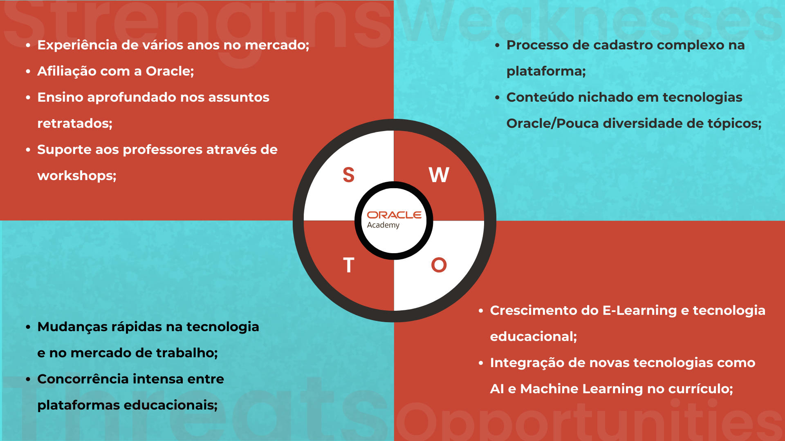<br>
<sub>Fonte: Material produzido pelos autores (2024)</sub>
</div>
<br>

### 1.1.3. Descrição da Solução Desenvolvida

&nbsp;&nbsp;&nbsp;&nbsp;O problema principal que nosso projeto visa resolver é o longo e complexo processo de onboarding de novos professores de tecnologia na plataforma. Entendemos que os professores possuem uma quantidade de tempo muito excassa, o que corrobora com a necessidade de manter o usuário engajado, por ter que passar parte de seu dia aprendendo. <br>&nbsp;&nbsp;&nbsp;&nbsp;A nossa solução resolve o processo de difícil entendimento de onboarding dos professores na plataforma Oracle Academy, através de um jogo que será disponibilizado de forma web. Na nossa visão, o professor gasta muita energia tentando ter acesso à plataforma, por isso, o jogo será implementado diretamente na plataforma, para que o professor o acesse assim que entrar no site. Com isso, o projeto traz como principais benefícios para os usuários, a intuitividade e a facilidade trazidas para um processo que antes era massante e um maior engajamento e visibilidade para a empresa. <br>&nbsp;&nbsp;&nbsp;&nbsp;O jogo será feito utilizando o framework Phaser, e a linguagem de programação Javascript. Serão utilizadas estratégias de gamificação para tornar o aprendizado sobre as funcionalidades, navegação e criação de contas na plataforma mais interativa e engajante, mas não infantilizada.<br>&nbsp;&nbsp;&nbsp;&nbsp;Para embasar o desenvolvimento, utilizamos os materiais enviado pelo parceiro, como o guia de cores da empresa, o próprio TAPI, o site da oracle e da oracle academy. Acreditamos que o sucesso será atingido quando conseguirmos consolidar uma comunidade forte de novos entrantes e futuramente, adultos já consolidados na área da tecnologia.

### 1.1.4. Proposta de Valor

&nbsp;&nbsp;&nbsp;&nbsp;Nós entendemos que o jogo tem muito a agregar tanto no âmbito acadêmico quanto no profissional dos professores. O maior problema não é somente a falta de vontade, mas a falta de alternativas práticas, rápidas, e interativas de se acessar esse conteúdo para assim serem ajudados a ensinarem os seus alunos. <br> &nbsp;&nbsp;&nbsp;&nbsp;Queremos trazer a melhor experiência possível para os usuários, ao eliminarmos o aprendizado alternativo, sendo necessário buscar vários tutoriais. Com o nosso jogo isso não acontecerá. Traremos praticidade. <br> &nbsp;&nbsp;&nbsp;&nbsp;
Em suma, o valor do nosso produto é facilitar e aprimorar o acesso a plataforma Oracle Academy.

<div align="center">
<sub>Figura 2 - Canvas Proposta de Valor representada graficamente</sub><br>
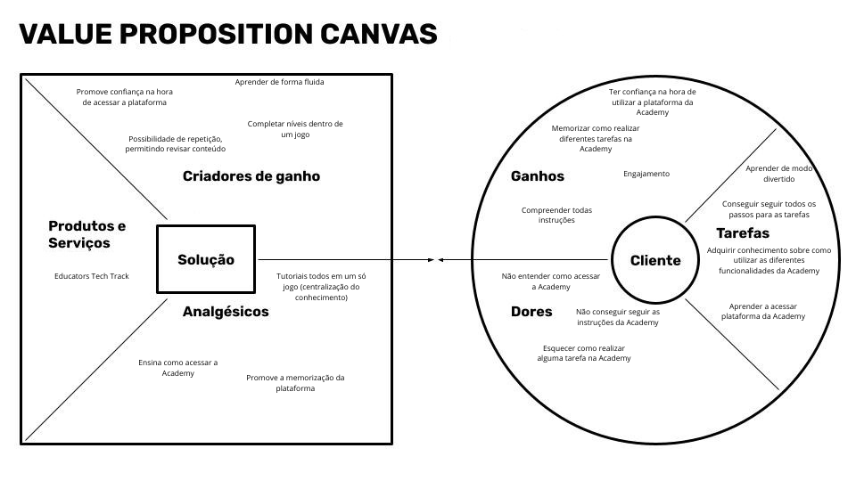<br>
<sub>Fonte: Material produzido pelos autores (2024)</sub>
</div>
<br>

### 1.1.5. Matriz de Riscos

<div align="center">
<sub>Figura 3 - Representação gráfica da matriz de riscos</sub><br>
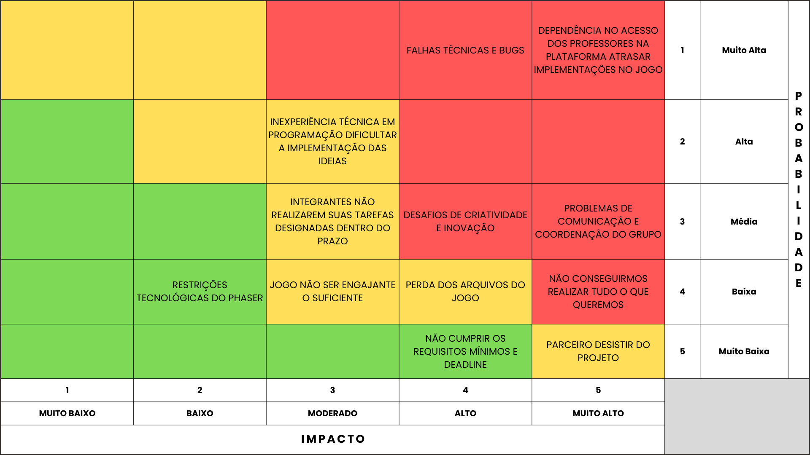<br>
<sub>Fonte: Material produzido pelos autores (2024)</sub>
</div>
<br>

### 1.1.6. Análise das 5 forças de Porter (sprint 4)

-**Rivalidade entre concorrentes**: A rivalidade entre concorrentes é evidente, com a Oracle Academy enfrentando a concorrência de outras instituições de educação em tecnologia, como a Microsoft Imagine Academy, Cisco Networking Academy e Google for Education. A competição é moderada, dada a diversidade de opções disponíveis para estudantes e instituições educacionais. Entretanto, a Oracle Academy destaca-se por oferecer treinamentos especializados nas tecnologias Oracle, o que pode ser particularmente atraente para certos clientes.

-**Ameaça de novos entrantes**: A ameaça de novos entrantes no mercado de educação tecnológica é moderada. Apesar da facilidade relativa de ingresso no mercado, conquistar uma base de clientes leais e estabelecer credibilidade é um desafio. A Oracle Academy, já estabelecida no mercado e com uma ampla rede de parceiros educacionais, criando uma barreira para novos concorrentes.

-**Poder de barganha dos clientes**: O poder de barganha dos compradores, representado por instituições de ensino e estudantes, é reduzido. Eles possuem certa influência na seleção dos programas de treinamento tecnológico que melhor atendem às suas necessidades. No entanto, a Oracle Academy pode manter sua competitividade oferecendo recursos exclusivos, acesso a tecnologias Oracle e parcerias com instituições renomadas, o que reduz o poder de barganha dos compradores.

-**Poder de barganha dos fornecedores**:O poder de barganha dos fornecedores é menor pelo fato de a Oracle Academy ser parte da Oracle Corporation, o que lhe permite ter acesso preferencial a recursos e tecnologias a preços competitivos.

-**Ameaça de produtos substitutos**: A ameaça de produtos ou serviços substitutos é crescente. Embora existam alternativas como cursos online gratuitos e plataformas de e-learning, a Oracle Academy oferece um programa mais estruturado e focado nas tecnologias Oracle. Entretanto, a popularidade crescente dessas plataformas gratuitas pode representar uma ameaça se os clientes as considerarem substitutos para programas formais como os oferecidos pela Oracle Academy.

<div align="center">
<sub>Figura 4 - Representação gráfica da análise das 5 forças de Porter</sub><br>
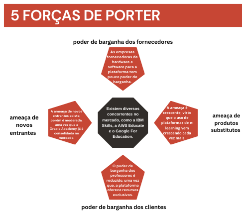<br>
<sub>Fonte: Material produzido pelos autores (2024)</sub>
</div>
<br>
=======
<div align="center">
<sub>Tabela 1 - Representação da matriz de riscos</sub><br>

| Ameaças                                                                    | Probabilidade | Impacto  | Plano de Ação                                                                                                                                   |
| -------------------------------------------------------------------------- | ------------- | -------- | ----------------------------------------------------------------------------------------------------------------------------------------------- |
| Inexperiência Técnica em Programação Dificultar a Implementação das Ideias | Média         | Moderado | Realizar sessões de feedback frequentes para refinar o jogo com base nas sugestões dos professores                                              |
| Não Cumprir os Requisitos Mínimos e Deadline                               | Muito baixa   | Alto     | Priorizar as funcionalidades essenciais para garantir a entrega do MVP dentro do prazo                                                          |
| Perda dos Arquivos do Jogo                                                 | Baixa         | Alto     | Realizar vários backups em diferentes lugares e fazer upload dos arquivos dentro do GitHub                                                      |
| Integrantes não Realizarem suas Tarefas Designadas dentro do Prazo         | Baixa         | Baixo    | Conversar de maneira franca e respeitosa com essa pessoa, e entender os motivos por trás desse impedimento                                      |
| Jogo não ser Engajante o Suficiente                                        | Baixa         | Moderado | Utilizar estratégias de gamificação que visem o público alvo, e realizar testes com professores para descobrir quais áreas devem ser melhoradas |
| Falhas Técnicas e Bugs                                                     | Alta          | Baixo    | Estabelecer um processo rigoroso de teste beta, envolvendo usuários finais (professores) para identificação precoce de problemas                |
| Problemas de Comunicação e Coordenação no Grupo                            | Média         | Baixo    | Implementar ferramentas de gestão de projetos e comunicação para melhorar a coordenação e o acompanhamento de tarefas                           |
| Desafios de Criatividade e Inovação para o Jogo                            | Baixa         | Baixo    | Promover brainstormings com feedback externo para inspirar soluções criativas e inovadoras                                                      |

</div>
<div align="center">
<sub>Fonte: Material produzido pelos autores (2024)</sub>
</div>
<br>

<div align="center">
<sub>Figura 5 - Matriz de Riscos representada graficamente</sub><br>
<br>
<sub>Fonte: Material produzido pelos autores (2024)</sub>
</div>
<br>

### 1.1.6. Análise das 5 forças de Porter

- Rivalidade entre concorrentes: A rivalidade entre concorrentes é evidente, com a Oracle Academy enfrentando a concorrência de outras instituições de educação em tecnologia, como a Microsoft Imagine Academy, Cisco Networking Academy e Google for Education. A competição é moderada, dada a diversidade de opções disponíveis para estudantes e instituições educacionais. Entretanto, a Oracle Academy destaca-se por oferecer treinamentos especializados nas tecnologias Oracle, o que pode ser particularmente atraente para certos clientes.

- Ameaça de novos entrantes: A ameaça de novos entrantes no mercado de educação tecnológica é moderada. Apesar da facilidade relativa de ingresso no mercado, conquistar uma base de clientes leais e estabelecer credibilidade é um desafio. A Oracle Academy, já estabelecida no mercado e com uma ampla rede de parceiros educacionais, criando uma barreira para novos concorrentes.

- Poder de barganha dos clientes: O poder de barganha dos compradores, representado por instituições de ensino e estudantes, é reduzido. Eles possuem certa influência na seleção dos programas de treinamento tecnológico que melhor atendem às suas necessidades. No entanto, a Oracle Academy pode manter sua competitividade oferecendo recursos exclusivos, acesso a tecnologias Oracle e parcerias com instituições renomadas, o que reduz o poder de barganha dos compradores.

- Poder de barganha dos fornecedores:O poder de barganha dos fornecedores é menor pelo fato de a Oracle Academy ser parte da Oracle Corporation, o que lhe permite ter acesso preferencial a recursos e tecnologias a preços competitivos.

- Ameaça de produtos substitutos: A ameaça de produtos ou serviços substitutos é crescente. Embora existam alternativas como cursos online gratuitos e plataformas de e-learning, a Oracle Academy oferece um programa mais estruturado e focado nas tecnologias Oracle. Entretanto, a popularidade crescente dessas plataformas gratuitas pode representar uma ameaça se os clientes as considerarem substitutos para programas formais como os oferecidos pela Oracle Academy.

<div align="center">
<sub>Figura 6 - Representação gráfica da análise das 5 forças de Porter</sub><br>
<br>
<sub>Fonte: Material produzido pelos autores (2024)</sub>
</div>
<br>

## 1.2. Requisitos do Projeto

<div align="center">
<sub>Tabela 2 - Representação dos requisitos do projeto</sub><br>

| \#  | Requisitos                                                        |
| --- | ----------------------------------------------------------------- |
| 1   | Fazer um serious game                                             |
| 2   | Contemplar o mapeamento da jornada do professor na Oracle Academy |
| 3   | Ser em primeira pessoa                                            |
| 4   | Acesso do jogo via Web/PC                                         |
| 5   | Publicação do jogo em Git Pages                                   |
| 6   | Seguir as Brand Guidelines da Oracle                              |
| 7   | Fazer um Game Design Document                                     |

<sub>Fonte: Material produzido pelos autores (2024)</sub>

</div>
<br>

## 1.3. Lista de Tarefas

- Implementar os assets da fase 4
- Implementar o botão para mutar a trilha sonora do jogo
- Corrigir o debug da fase 3
- Implementar os aprendizados da aula de ux em nossa trilha sonora
- Fazer os assets da fase 5
- Implementar os assets da fase 5
- Testar o jogo completo
- Validar o produto com o cliente

## 1.4. Público-alvo do Projeto

&nbsp;&nbsp;&nbsp;&nbsp;O público-alvo do nosso jogo são professores de conteúdos associados à tecnologia no Brasil, que buscam e/ou necessitam aprender a utilizar o ambiente da Oracle Academy, e ensinar para seus alunos os conteúdos presentes nesse sistema. Ademais, é importante ressaltar que esses professores podem estar agindo de forma independente de sua escola, já que não é necessário a integração de todos os docentes da escola utilizarem a plataforma, ou até mesmo a escola. <br> &nbsp;&nbsp;&nbsp;&nbsp;Entendemos também que os educadores que gostam de resolver quebra cabeças, fazer dinâmicas e que procuram diferentes formas de aprendizado, como o proposto pelo nosso jogo. <br> &nbsp;&nbsp;&nbsp;&nbsp; Em torno de 2,2 milhões de pessoas exercem a profissão de educador na educação básica e 323.376, no ensino superior no Brasil. Ao mesmo tempo, 92% dos professores de escolas públicas e 86% de escolas particulares buscam, por conta própria aprender sobre tecnologia. Ou seja, o aprendizado relacionado à tecnologia é conduzido de forma independente pela maioria dos professores.

# <a name="c2"></a>2. Visão Geral do Jogo

## 2.1. Objetivos do Jogo

&nbsp;&nbsp;&nbsp;&nbsp;O objetivo é que os usuários ao final do jogo tenham completa competência e maestria em como a plataforma Oracle Academy funciona, desde o sistema de login, até navegar pelos diferentes cursos e adicionar os seus alunos. O jogador deve resolver uma série de diferentes desafios para que os professores se sintam engajados ao jogar e que tenham confiança ao aplicar os aprendizados no mundo real. Também consideramos importante reforçar o aprendizado durante o tempo de jogo, já que é de grande importante que o usuário aprenda sobre a plataforma Oracle Academy.

## 2.2. Características do Jogo

### 2.2.1. Gênero do Jogo

&nbsp;&nbsp;&nbsp;&nbsp;De acordo com o dicionário de Cambridge, a palavra _puzzle_ é: "um problema ou pergunta que você precisa resolver usando sua habilidade ou conhecimento". Dessa forma, alinhamos os objetivos, os requisitos, e decidimos que a melhor estratégia para entregar o MVP foi criar o jogo nessa temática. Também decidimos adicionar dois outros gêneros, simulação, e um dos requisitos, serious game.<br>
&nbsp;&nbsp;&nbsp;&nbsp;Um dos benefícios do gênero de simulação é trazer imersão para o mundo e história do jogo, além de permitir que os usuários possam colocar seus conhecimentos e habilidade do jogo em teste. Por fim, o gênero serious game está ligado ao teor educacional que queremos trazer.

### 2.2.2. Plataforma do Jogo

&nbsp;&nbsp;&nbsp;&nbsp;O jogo está sendo desenvolvido para a plataforma desktop para permitir uma padronização maior do dispositivos no qual ele será rodado. Foi orientado que fosse utilizada o framework Phaser, dessa forma, o desenvolvimento web também facilitará o acesso para o público-alvo.

### 2.2.3. Número de jogadores

&nbsp;&nbsp;&nbsp;&nbsp;Para seguir a recomendação de jogo da parceira, um jogo de puzzle de um jogador teria as seguintes vantagens:

<ul>
<li>Permite ao jogador focar na resolução dos desafios lógicos, sem distrações ou interferências de outros jogadores;</li>
<li>Oferece ao jogador um ritmo próprio de aprendizado e progressão, sem pressão ou competição;</li>
<li>Estimula o pensamento criativo e a experimentação do jogador, sem limitações ou restrições impostas por outros jogadores;</li>
<li>Cria uma experiência mais imersiva e envolvente para o jogador, que se sente mais conectado com o mundo e a história do jogo.</li>
</ul>

&nbsp;&nbsp;&nbsp;&nbsp;Ou seja, um jogo singleplayer é a melhor opção que encontramos para o projeto.

### 2.2.4. Títulos semelhantes e inspirações

&nbsp;&nbsp;&nbsp;&nbsp;Para criar qualquer tipo de ideia, é impossível não associarmos com algum outro conceito que nos inspirou, pode ser de forma direta, como por exemplo algum projeto com temáticas parecidas que decidimos usar como fonte para posteriormente torná-lo nosso, ou indireta, como lógicas de programação que têm certa similaridade, porém, não de forma intencional. Para o nosso jogo, pesquisamos vários jogos que tivessem entre 3 atributos (estética, mecânicas, gênero) essenciais que tivesse destaque para usarmos como inspiração para o nosso, entretanto, não era necessário conter todos esses atributos, apenas um. Esses foram os jogos de maior relevância:

<ul> <li>Carcará: Asas da Justiça, um serious game desenvolvido pela SuperNova Games que oferece uma experiência imersiva e envolvente, o jogo estimula o pensamento crítico, promove a compreensão do sistema judicial e educa os jogadores sobre questões éticas e legais relevantes à sociedade contemporânea.</li>
<li>A Little to the Left, um jogo de quebra-cabeça que desafia os jogadores a classificar, empilhar e organizar objetos em cenários variados, estimulando a formulação de estratégias variadas para resolver os mais de 100 desafioas que o jogo oferece, tudo isso com uma jogabilidade intuitiva e estética "fofa" e envolvente.</li>
<li>Unpacking, um jogo relaxante que consiste em desembalar e organizar objetos em um novo lar, a mecânica envolve uma combinação entre quebra-cabeças e decorações de interiores, incentivando o player a ter um senso de organização.</li>
<li>Aperture Desk Job, um jogo ambientado no famoso universo de "Portal" que consiste em gerenciar uma fábrica caótica através de puzzles em sua mesa de trabalho.</li>
<li>Chants of Sennar é um jogo ambientado em um deserto antigo, onde o personagem principal é um estrangeiro de uma terra distante que acorda em uma cidade totalmente diferente daquela que conhecia, possuindo apenas um caderno de notas com o objetivo de decifrar e entender a língua dessa civilização. Trata-se de um jogo repleto de quebra-cabeças que incentivam o jogador a usar ao máximo suas capacidades lógicas enquanto descobre mais sobre a sociedade.</li></ul>

### 2.2.5. Tempo estimado de jogo

&nbsp;&nbsp;&nbsp;&nbsp;O jogo pode ser concluído entre 10 a 20 minutos.

# <a name="c3"></a>3. Game Design

## 3.1. Enredo do Jogo

&nbsp;&nbsp;&nbsp;&nbsp;A história do jogo inicia em uma sala de aula, onde o professor ensina sua classe, e na lousa atrás dele existe uma desenho de um mapa do mundo. O professor começa a comentar sobre a plataforma que está usando, da sua experiência, de como os alunos irão acessar, e decidiu fazer uma analogia com o mapa. Entramos assim, no mundo da imaginação desses alunos, convertendo a interpretação deles em diferentes fases, desafios, toda a aventura do professor pelo mundo, adicionando vários elementos da conversa como objetos dentro das fases, mapas e easter eggs.

<div align="center">
<sub>Figura 7 - Contexto inicial de nosso game</sub>

<sup>Fonte: Material produzido pelos autores (2024)</sup>
</div>

## 3.2. Personagens e/ou Elementos Interativos

### 3.2.1. Controláveis

### Professor

&nbsp;&nbsp;&nbsp;&nbsp;Na segunda parte da fase 4, a temática principal é de um professor que precisa levar seus alunos para a cloud. O jogador deve controlar esse professor em cima de um gramado para chegar no objetivo.<br>
&nbsp;&nbsp;&nbsp;&nbsp;Além desse controlável, não há nenhum outro personagem representado que seja utilizado pelo player do nosso game.

<div align="center">
<sub>Figura 8 - Professor controlável</sub>

<sup>Fonte: Material produzido pelos autores (2024)</sup>
</div>

### 3.2.2. Non-Playable Characters (NPC)

&nbsp;&nbsp;&nbsp;&nbsp;Na segunda etapa da Fase 4 do jogo, assumimos o intrigante papel de um professor cuja missão é interagir com os alunos e incentivá-los a irem até a "nuvem" — um conceito metafórico para a cloud. Os alunos com os quais interagimos são personagens não jogáveis (NPCs) criados de maneira dinâmica e aleatória, utilizando uma variedade de assets pré-definidos. Esses assets, que formam a base dos NPCs, incluem uma ampla gama de características visuais e de personalidade, permitindo que cada aluno apareça único em aparência.

<div align="center">
<sub>Figura 9 - Aluno 1</sub>
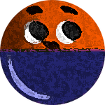
<sup>Fonte: Material produzido pelos autores (2024)</sup>
</div>

<div align="center">
<sub>Figura 10 - Aluno 2</sub>
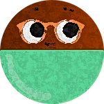
<sup>Fonte: Material produzido pelos autores (2024)</sup>
</div>

<div align="center">
<sub>Figura 11 - Aluno 3</sub>
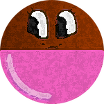
<sup>Fonte: Material produzido pelos autores (2024)</sup>
</div>

<div align="center">
<sub>Figura 12 - Aluno 4</sub>
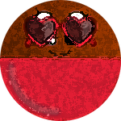
<sup>Fonte: Material produzido pelos autores (2024)</sup>
</div>

<div align="center">
<sub>Figura 13 - Aluno 5</sub>
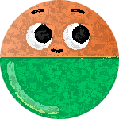
<sup>Fonte: Material produzido pelos autores (2024)</sup>
</div>

<div align="center">
<sub>Figura 14 - Aluno 6</sub>
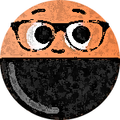
<sup>Fonte: Material produzido pelos autores (2024)</sup>
</div>

<div align="center">
<sub>Figura 15 - Aluno 7</sub>
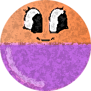
<sup>Fonte: Material produzido pelos autores (2024)</sup>
</div>

<div align="center">
<sub>Figura 16 - Aluno 8</sub>
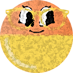
<sup>Fonte: Material produzido pelos autores (2024)</sup>
</div>

<div align="center">
<sub>Figura 17 - Aluno 9</sub>
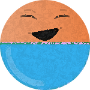
<sup>Fonte: Material produzido pelos autores (2024)</sup>
</div>

<div align="center">
<sub>Figura 18 - Aluno 10</sub>
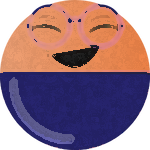
<sup>Fonte: Material produzido pelos autores (2024)</sup>
</div>

<div align="center">
<sub>Figura 19 - Aluno 11</sub>
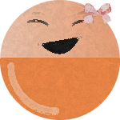
<sup>Fonte: Material produzido pelos autores (2024)</sup>
</div>


<div align="center">
<sub>Figura 20 - Aluno 12</sub>
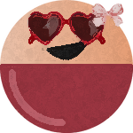
<sup>Fonte: Material produzido pelos autores (2024)</sup>
</div>

### 3.2.3. Diversidade e Representatividade

&nbsp;&nbsp;&nbsp;&nbsp;O Educators Tech Track foi criado com o intuito de oferecer ao usuário uma experiência de jogo envolvente com um ambiente visual e auditivo que respeite a diversidade e as necessidades dos docentes da área da tecnologia que irão se envolver no processo de jogatina. Segundo dados revelados pelo INEP em 2022, 516.484 docentes atuam no ensino médio e 323.376, no ensino superior, considerando que o país possui aproximadamente 3 milhões de profissionais na área, os docentes de disciplinas técnicas de tecnologia são um pequeno grupo dentro dos 26,67% que engloba o ensino médio e graduação. Dessa forma, precisamos acolher esse público através do gameplay com o nosso jogo. Para alcançarmos esse objetivo, cada aspecto do jogo foi cuidadosamente considerado.

&nbsp;&nbsp;&nbsp;&nbsp;Devido ao supramencionado, decidimos que, ao iniciar o jogo, os jogadores visualizam uma tela de créditos que apresenta a equipe de desenvolvimento e fornece uma introdução detalhada sobre a origem do jogo e sua proposta. Essa abordagem visa estabelecer uma conexão inicial com o público-alvo, criando um maior esclarecimento e oferecendo transparência e engajamento desde o início. Considerando os índices revelados a respeito de docentes no país, toda a nossa estética busca trazer um conforto e desejo de engajamento por parte do nosso público-alvo.

&nbsp;&nbsp;&nbsp;&nbsp;O menu de fases é projetado para ser uma interface funcional. Ao apresentar um mapa mundial, os jogadores são convidados a explorar uma variedade de contextos culturais, ampliando assim sua compreensão e apreciação da diversidade global, focando nos países: Estados Unidos, Egito, Polônia, Indonésia e Brasil.

&nbsp;&nbsp;&nbsp;&nbsp;Cada fase é cuidadosamente estruturada para fornecer orientação clara e concisa aos jogadores. Uma tela de instruções inicial, com texto de fácil leitura sobre fundo preto, garante que os objetivos e as mecânicas de cada desafio sejam compreendidos de forma eficaz. Essa abordagem busca garantir a acessibilidade do jogo. Nesse contexto, realizamos um playtest entre pessoas com Deuteranopia, também nomeada como “cegueira verde”, que é um tipo de daltonismo, recebendo assim o feedback de que, pela escolha da nossa paleta de cores, o jogo é totalmente jogável e compreensível por formas e cores serem bem separadas e identificáveis. Assim, conseguimos compreender a nossa adequação para esta deficiência em específico.

&nbsp;&nbsp;&nbsp;&nbsp;Além disso, a inclusão de efeitos sonoros intuitivos para cada ação e interação no jogo enriquece a experiência auditiva e oferece uma camada adicional de compreensão e imersão para o usuário, mesmo que o próprio possua algum tipo de dificuldade em localizar se está tomando as escolhas corretas. Como exemplo, na primeira fase, existem sons no momento de coleta da polaroid, no momento de soltura, quando o usuário coloca a polaroid no lugar correto faz barulho afirmativo e quando a polaroid é posta no lugar errado, é emitido um som de negação.

&nbsp;&nbsp;&nbsp;&nbsp;Na fase 2, disponibilizamos um barulho de escavação ao longo da dinâmica e ao clicar no objeto acontece um som que mostra para uma pessoa que está jogando que o objeto está disponível para visualização.

&nbsp;&nbsp;&nbsp;&nbsp;A fase 3 possui 3 sons: quando você conecta os fios, simbolizando que a conexão estava correta, quando você entra no servidor, simbolizando que a fase avançou e quando você clica na televisão para mostrar que uma nova etapa da fase ocorrerá, desta vez com informação.

&nbsp;&nbsp;&nbsp;&nbsp;Ademais, a fase 4 possui diversos sons: como o baú abrindo, o baú fechando, quando aparece um pop up, e quando o usuário mexe um aluno. Nesse contexto, podemos comprovar que estamos trazendo ações intuitivas para todos os jogadores por meio de sinais sonoros.

&nbsp;&nbsp;&nbsp;&nbsp;Por fim, em quesitos de diversidade de personagem, destacamos a Fase 4, que leva os jogadores a uma aventura imersiva pela ilha de Java, na Indonésia. Esta fase é especialmente notável por ser a única no jogo que apresenta um personagem jogável específico, além de uma variedade de personagens não jogáveis (NPCs). A ambientação é cuidadosamente projetada para destacar a rica arquitetura e cultura indonésia, permitindo que os jogadores explorem e apreciem a beleza e diversidade da região. Em um esforço para promover a inclusão e a representatividade, a fase foi desenvolvida com uma ênfase especial na diversidade de personagens. Durante a segunda metade da fase, os jogadores interagem com um grupo de alunos que representam uma ampla gama de etnias, incluindo, mas não limitado a, personagens de ascendência africana, asiática e caucasiana. Essa escolha de design visa refletir um mundo mais inclusivo e diversificado, reforçando a mensagem de que a diversidade é uma força que enriquece nossas experiências.

<div align="center">
<sub>Figura 21 - Aluno com ascendência africana</sub>

<sup>Fonte: Material produzido pelos autores (2024)</sup>
</div>

<div align="center">
<sub>Figura 22 - Aluno com ascendência caucasiana</sub>

<sup>Fonte: Material produzido pelos autores (2024)</sup>
</div>

<div align="center">
<sub>Figura 23 - Aluno Aluno com ascendência asiática</sub>

<sup>Fonte: Material produzido pelos autores (2024)</sup>
</div>

&nbsp;&nbsp;&nbsp;&nbsp;O principal objetivo desta fase é não apenas avançar no jogo, mas também educar e sensibilizar os jogadores sobre a importância da diversidade cultural e étnica. Ao navegar pela ilha de Java e interagir com os diversos personagens, os jogadores têm a oportunidade de aprender sobre diferentes culturas e perspectivas, promovendo assim uma maior compreensão e apreciação das riquezas culturais do mundo.

## 3.3. Mundo do jogo

### 3.3.1. Locações Principais e/ou Mapas

&nbsp;&nbsp;&nbsp;&nbsp;O jogo começa em uma sala de aula, e posteriormente é levado para dentro do quadro da sala de aula, onde poderá explorar países como Estados Unidos, Egito, Polônia, Indonésia e o Brasil. A seleção de fases será um mapa antigo com todos os locais descritos destacados, e cada fase será tematizada com aspectos de sua respectiva região, contendo também elementos do universo que o jogo cria. Estamos desenvolvendos o level design e os puzzles das fases, e decidimos a temática de cada fase.

**1. Estados Unidos da América - California:** Ordenar imagens/polaroids na ordem dos passos para o cadastro na plataforma para desvendar um mistério. Essa fase contará com um sistema de magnetismo nas fotos com seus respectivos lugares;

**2. Egito - Cairo:** Escavar/desvendar as funções disponíveis para o professor em uma escavação arqueológica no Egito. Existirá como desafio adicional a tradução de uma linguagem desconhecida que precisa ser desvendada para descobrir todas as funções e como o professor pode usá-las;

**3. Polônia - Varsóvia:** Conectar cabos/energia em um servidor da Polônia, criando canais de servidores para sair daquela fase. Ainda estamos desenvolvendo quais mecânicas serão utilizadas;

**4. Arquipélago indonésio/Ilha de Java - Indonésia:** Navegação pelo mar e pelas ilhas a fim de ensinar sobre como o professor faz o caminho para a integração com a Nuvem. Ainda estamos desenvolvendo quais mecânicas serão utilizadas;

**5. São Paulo - Brasil:** Suporte para outros professores pelo mundo, reforçando o aprendizado da jornada e ensinando sobre o suporte para os professores. O jogador deve ajudar 5 diferentes professores que são dos mesmos lugares que visitou pelo mundo, sendo necessário fazer as escolhas corretas sobre tudo que aprendeu.

<div align="center">
<sub>Figura 24 - Tela do menu de fases</sub>
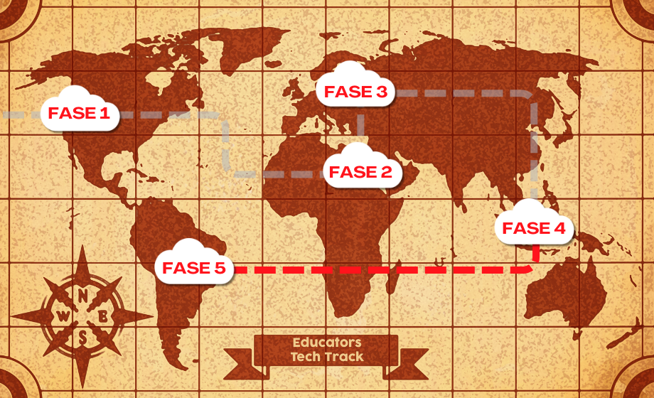
<sup>Fonte: Material produzido pelos autores (2024)</sup>
</div>

### 3.3.2. Navegação pelo mundo

&nbsp;&nbsp;&nbsp;&nbsp;A navegação acontecerá através de um mapa do mundo. Existem pins nos locais em que o jogador pode visitar conforme for desbloqueando as fases anteriores. Para entrar nas fases o usuário usará o mouse, e quando clicar, a cena irá mudar para a fase que foi selecionada. Como existe uma progressão para o aprendizado do professor, é mais coerente que as fases também sigam essa vertente.

### 3.3.3. Condições climáticas e temporais

&nbsp;&nbsp;&nbsp;&nbsp;Não se aplica

### 3.3.4. Concept Art

&nbsp;&nbsp;&nbsp;&nbsp;Aqui está incluído as Concepts Arts das fases, desde a sua primeira idealização, até modelos visuais mais semelhantes com a estética do jogo.

<div align="center">
<sub>Figura 25 - Concept Art do mapa de fases em papel</sub>
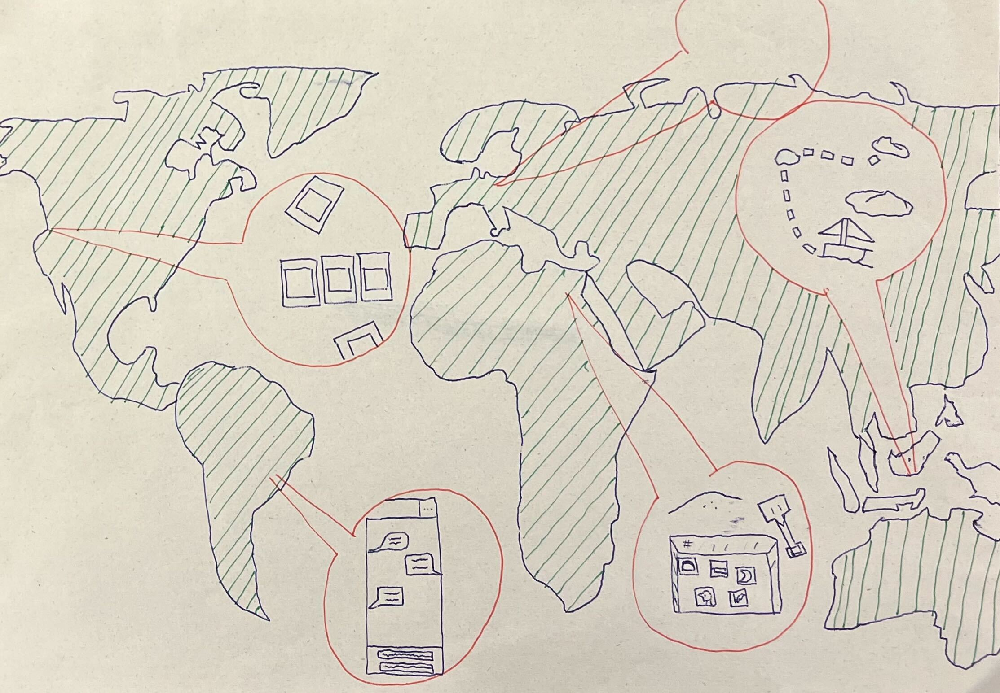
<sup>Fonte: Material produzido pelos autores (2024)</sup>
</div>
<br>

<div align="center">
<sub>Figura 26 - Concept Art do mapa feita com colagem digital</sub>
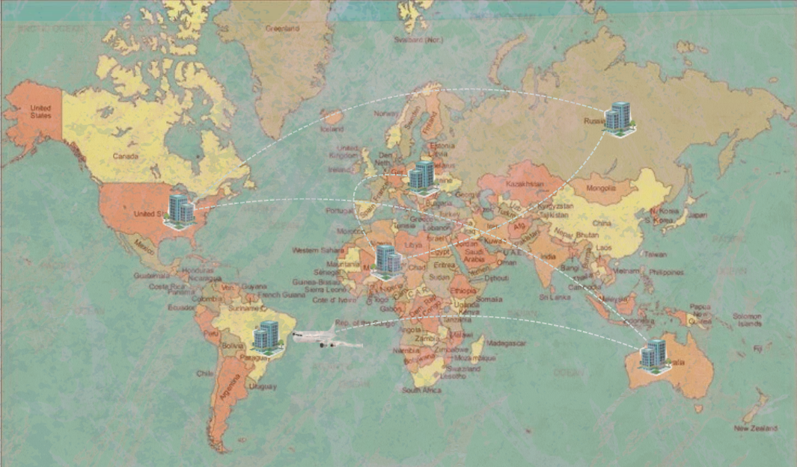
<sup>Fonte: Material produzido pelos autores (2024)</sup>
</div>
<br>

<div align="center">
<sub>Figura 27 - Concept Art do mapa e das fases nos seus respectivos países</sub>
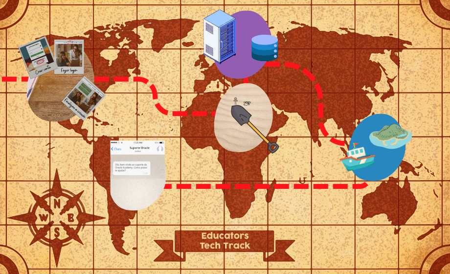
<sup>Fonte: Material produzido pelos autores (2024)</sup>
</div>

### 3.3.5. Trilha Sonora

<div align="center">
<sub>Tabela 3 - Representação das trilhas sonoras</sub><br>

| \#  | titulo     | ocorrência                      | autoria             |
| --- | ---------- | ------------------------------- | ------------------- |
| 1   | Introdução | Tela inicial e cena de créditos | Mixkit Music Tracks |
| 2   | Fase 1     | Durante a fase 1                | Hicks               |
| 3   | Fase 2     | Durante a fase 2                | Francisco Tárrega   |
| 4   | Fase 3     | Durante a fase 3                | Max McFerren        |
| 5   | Fase 4     | Durante a fase 4                | K.OReggae           |

<sub>Fonte: Material produzido pelos autores (2024)</sub>

</div>
<br>

## 3.4. Inventário e Bestiário

### 3.4.1. Inventário

&nbsp;&nbsp;&nbsp;&nbsp;Uma lista com todos os itens que o professor poderá interagir durante a experiência.

<div align="center">
<sub>Tabela 4 - Representação do inventário</sub><br>

| \#  | Item/Conjunto de itens                           | Imagem                                                            | Como Obter                                                    | Função                                                                    |
| --- | ------------------------------------------------ | ----------------------------------------------------------------- | ------------------------------------------------------------- | ------------------------------------------------------------------------- |
| 1   | Polaroids (16)                                   |  | Aparece automaticamente na mesa do professor na fase 1        | Ilustrar informações de como fazer um cadastro de professor na plataforma |
| 2   | Lixos do deserto (Latinhas, Besouro, Caranguejo) | 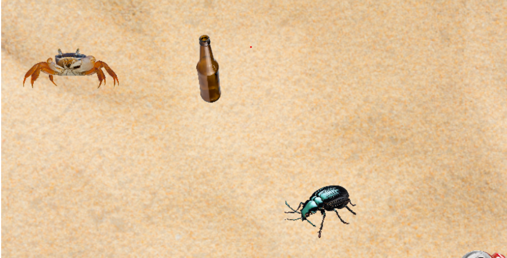                                  | Estão escondidos na areia na fase 2                           | Fazer o jogador tomar decisões                                            |
| 3   | Pergaminhos (9)                                  | 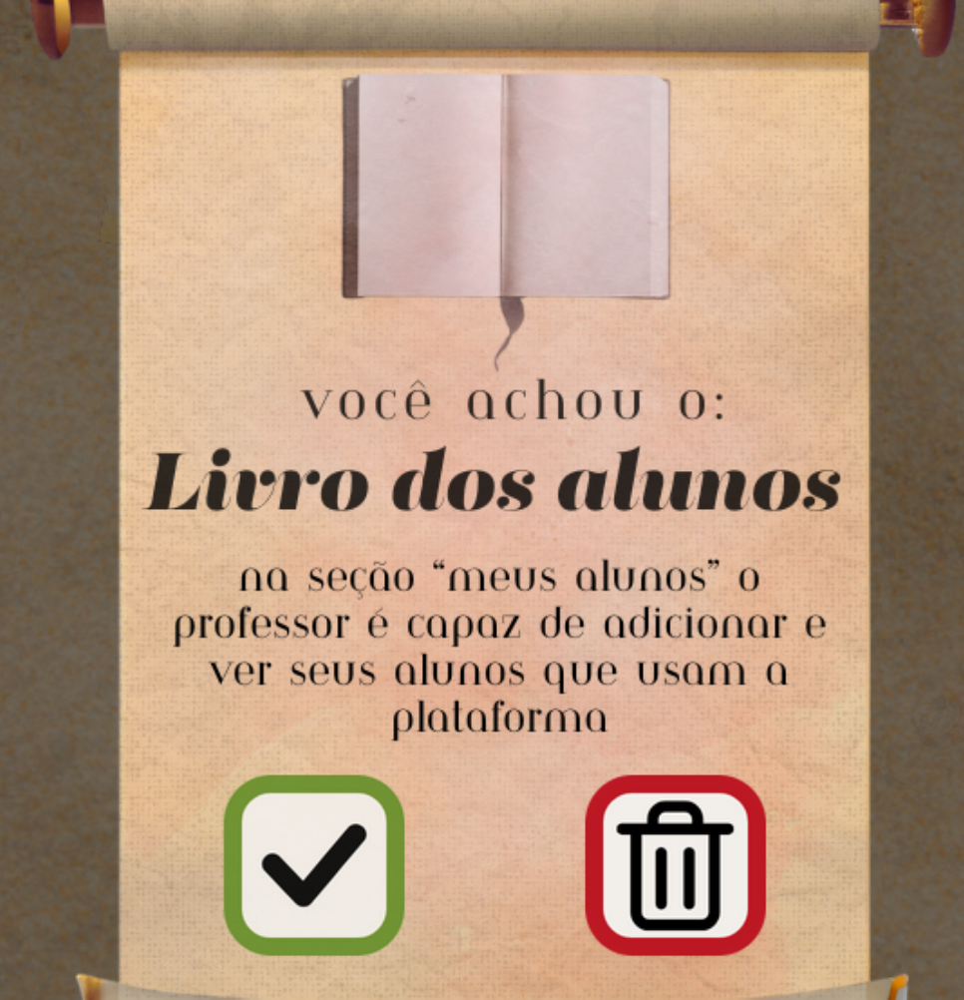                                 | Escavando na fase 2                                           | Mostrar ao Jogador quais são os recursos da Academy                       |
| 4   | Monitor A                                        | 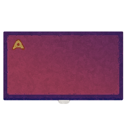                                | Clickando na maleta após o início da primeira parte da fase 3 | Montar o servidor do lado A                                               |
| 5   | Monitor B                                        | 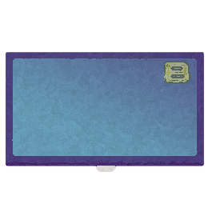                                | Clickando na maleta após o início da primeira parte da fase 3 | Montar o servidor do lado B                                               |
| 6   | Corda                                            |                                     | Clickando na maleta após o início da primeira parte da fase 3 | Montar o servidor do lado A/B                                             |
| 7   | CPU                                              | 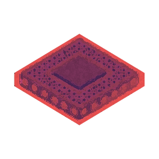                                    | Clickando na maleta após o início da primeira parte da fase 3 | Montar o servidor do lado A/B                                             |
| 8   | Pilha                                            | 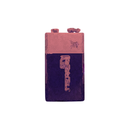                                    | Clickando na maleta após o início da primeira parte da fase 3 | Montar o servidor do lado A/B                                             |

<sub>Fonte: Material produzido pelos autores (2024)</sub>

</div>
<br>

## 3.5. Gameflow (Diagrama de cenas)

&nbsp;&nbsp;&nbsp;&nbsp;A seguir, encontra-se o fluxograma das cenas do jogo em imagem, com a sequência e especificações da progessão dos níveis, quanto a programação das classes. Para a visualização do projeto no figma na íntegra, basta acessar o seguinte link https://www.figma.com/file/GET2uITJBr9cNf5g0ntVqH/Game-Flow-(Educators-Tech-Track)-(Community)?type=whiteboard&node-id=0%3A1&t=3lFGJb4YE1h3x50Z-1<br>
&nbsp;&nbsp;&nbsp;&nbsp;A primeira cena é a animação para mostrar o nome inicial do jogo, contendo também um botão que inicia essa cutscene. Após a animação, o jogador será introduzido para a tela inicial do jogo, onde haverá informações sobre o projeto, crédito aos integrantes e professores, e o botão de começar o jogo, sendo esse o único interagível que levará para a próxima cena. Com o botão apertado, o usuário é levado para a tela de menu de fases, onde estará liberada apenas a fase 1, e conforme o jogador conclua mais fases, mais serão liberadas, sendo todas elas botões que levam para a cena de sua respectiva fase.<br>
&nbsp;&nbsp;&nbsp;&nbsp;Na primeira fase, existem as polaroids que possuem o tipo de ação "drag & drop", em que as imagens podem ser movidas pela tela, colocadas no espaço correto. Caso o espaço que o player tenha colocado seja o errado, a foto não irá se conectar, rejeitando-a. Porém, caso seja correta, irá ficar presa naquele espaço destinado à aquela polaroid.

<div align="center">
<sub>Figura 28 - Fluxograma de cenas e do storyboard de programação</sub><br>
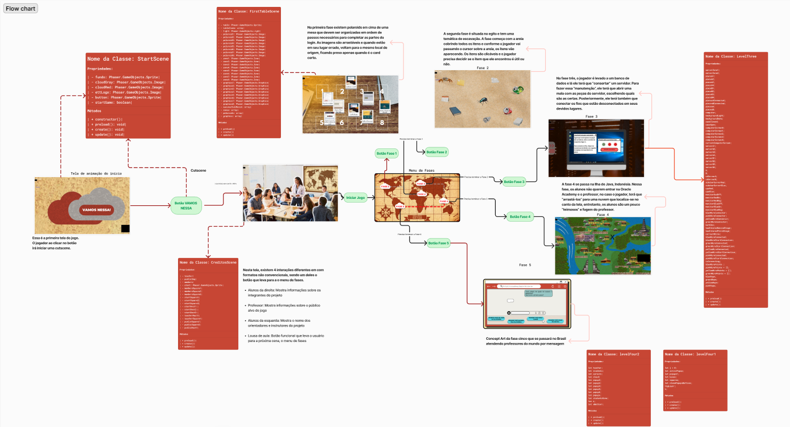<br>
<sub>Fonte: Material produzido pelos autores (2024)</sub>
</div><br>

<div align="center">
<sub>Figura 29 - Print tirado da classe StartGame</sub>
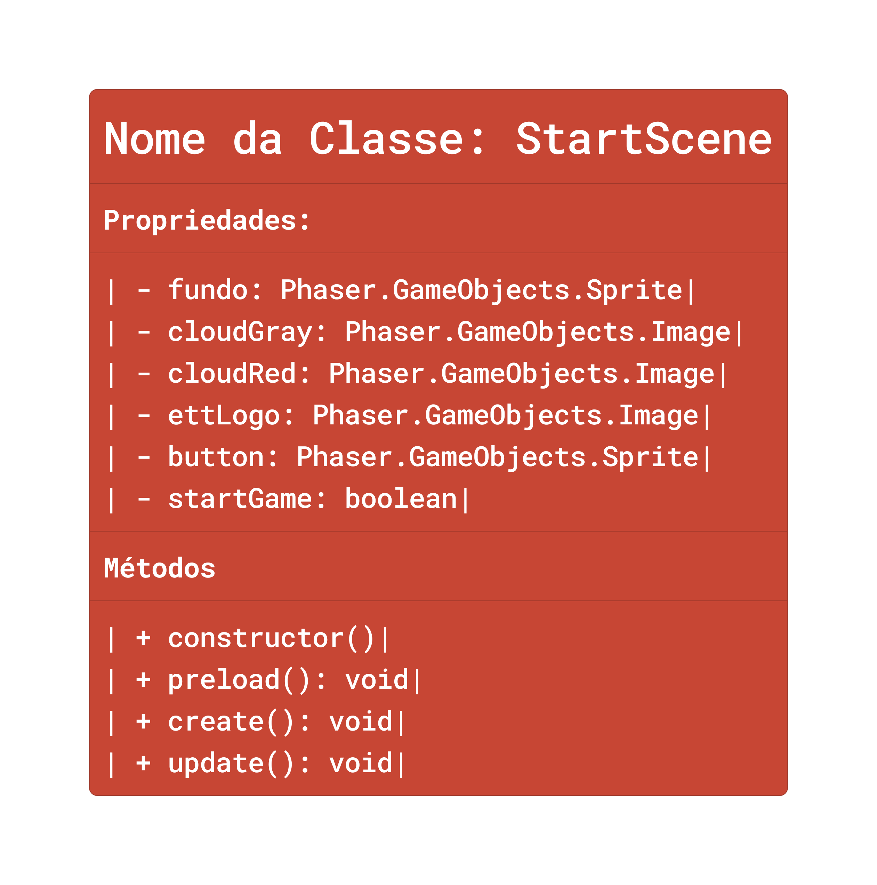<br>
<sub>Fonte: Material produzido pelos autores (2024)</sub>
</div><br>
<div align="center">
<sub>Figura 30 - Print tirado da classe CreditosScene</sub>
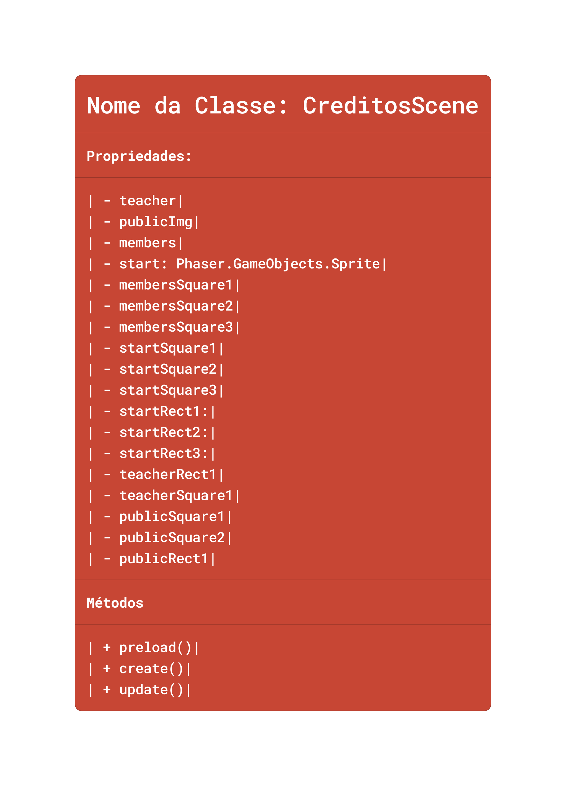<br>
<sub>Fonte: Material produzido pelos autores (2024)</sub>
</div><br>
<div align="center">
<sub>Figura 31 - Print tirado da classe FirstTableScene</sub>
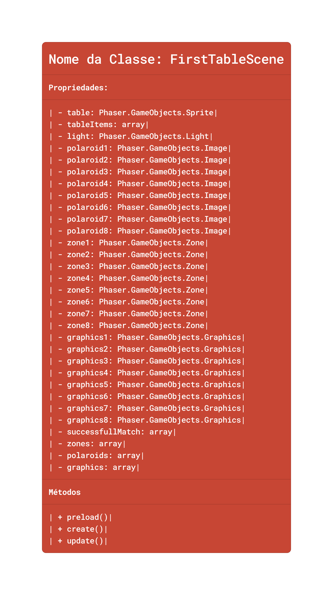<br>
<sub>Fonte: Material produzido pelos autores (2024)</sub>
</div><br>

## 3.6. Regras do jogo

&nbsp;&nbsp;&nbsp;&nbsp;O jogador deve seguir o caminho do menu de fases resolvendo cada puzzle, adquirindo o conhecimento sobre como utilizar a plataforma da Oracle Academy.

- Fase 1: O jogador deve colocar as polaroids na ordem correta, com cada uma contendo uma informação de como fazer o cadastro de professor na plataforna na ordem correta. Após isso poderá seguir para a próxima fase. Caso queira ampliar uma polaroid em específico, ele pode clicar duas vezes nela.

* Fase 2: O jogador deve escavar e procurar itens perdidos dentro da areia e ao analisá-los julgar se a informação obtida é útil ou não, descartando ou guardando na bag.

- Fase 3: O jogador deve abrir a maleta e arrastar com o mouse cada item que aparecer para o lado A ou B da tela. Aós concluir a montagem dos servidores, será necessário que se conecte os cabos tanto do servidor A quanto do servidor B. Ao término da montagem de cada servidor aparecerá um monitor que pode ser ampliado para visualização da instrução.

- Fase 4: O jogador deve clicar em cada X que aparece no mapa e aguardar o zoom da câmera. Concluído o zoom, ele deve clicar no baú e ler o popup que aparecerá. Ao fechar o popup, espera-se o zoom-out terminar e repete-se o processo até o último popup. Uma vez na segunda parte da fase, o jogador deve controlar o professor e conduzir os alunos até a cloud, lendo cada popup de instrução que aparecer.

## 3.7. Mecânicas do jogo

&nbsp;&nbsp;&nbsp;&nbsp;Utilizamos o Framework MDA para organizar as mecânicas do nosso projeto e deixar mais organizado.

<div align="center">
<sub>Tabela 4 - Representação das mecânicas do jogo</sub><br>

| \#  | Fase            | Mechanics                                                                                                                    | Dynamics                                                                                                                                                           | Aesthetics                                                                                                                                                   |
| --- | --------------- | ---------------------------------------------------------------------------------------------------------------------------- | ------------------------------------------------------------------------------------------------------------------------------------------------------------------ | ------------------------------------------------------------------------------------------------------------------------------------------------------------ |
| 1   | Polaroids       | Os Polaroids, representando fragmentos de uma narrativa, podem ser movidos e reorganizados para formar uma sequência lógica. | O jogador, ao segurar e arrastar os Polaroids, deve ordená-los corretamente para desbloquear o avanço na fase, estimulando a resolução de quebra-cabeças visuais   | A organização dos Polaroids não apenas desbloqueia o progresso, mas também cria uma estética visual coesa, proporcionando uma sensação de completude         |
| 2   | Escavação       | Os jogadores são desafiados a escavar áreas de areia em busca de objetos, decifrando mensagens e passos a seguir.            | Ao escavar uma área específica cheia de areia, o jogador descobre itens aleatórios que fornecem pistas para a ordem correta, encorajando a exploração estratégica. | A descoberta dos hieróglifos e a decodificação da mensagem proporcionam uma estética de desvendar mistérios, reforçando a sensação de progresso e conquista. |
| 3   | Canais          | Fios desconectados precisam ser habilmente interligados para otimizar o funcionamento do sistema.                            | O jogador enfrenta o desafio de conectar todos os fios do sistema, promovendo uma abordagem estratégica para resolver problemas de organização.                    | A interconexão dos fios não só restaura a funcionalidade, mas também cria uma estética organizada, destacando a importância da ordem na solução de desafios. |
| 4   | Ilha de Java    | Um arquipélago vasto aguarda exploração, requerendo o uso do barco e controles de teclado (A, W, S, D) para navegar.         | O jogador deve explorar o arquipélago, utilizando o barco e os controles direcionais, para coletar informações essenciais e avançar na fase.                       | A sensação de descoberta é aprimorada ao explorar diferentes ilhas, proporcionando uma estética visualmente rica e recompensadora.                           |
| 5   | Chat de Suporte | Um chat interativo com múltiplas opções de resposta, simulando um ambiente de suporte.                                       | O usuário é desafiado a escolher as respostas corretas em um chat interativo, fortalecendo a habilidade de tomar decisões e interagir com personagens virtuais.    | A dinâmica de companheirismo é realçada pela interação no chat, contribuindo para uma estética de cooperação e colaboração no ambiente virtual.              |

<sub>Fonte: Material produzido pelos autores (2024)</sub>

</div>
<br>

# <a name="c4"></a>4. Desenvolvimento do Jogo

&nbsp;&nbsp;&nbsp;&nbsp;A elaboração da documentação de um jogo assume uma importância crítica para desvendar a complexidade multifacetada inerente a cada aspecto do jogo e também para capturar sua evolução dinâmica ao longo do processo de desenvolvimento.

## 4.1. Desenvolvimento preliminar do jogo

&nbsp;&nbsp;&nbsp;&nbsp;Desenvolvemos a tela inicial do jogo e planejamos expandir para as próximas fases nos próximos sprints. Como nosso objetivo é equilibrar a seriedade educacional com a interatividade do jogo, é crucial que também seja uma experiência progressiva e acessível aos usuários. <br>
&nbsp;&nbsp;&nbsp;&nbsp;As fases do jogo representarão diferentes níveis de conhecimento e familiarização da plataforma, e ao final de cada uma dessas fases, haverá perguntas se o usuário entendeu ou gostaria de repetir mais lentamente, para realmente fixar aquele conteúdo.

<div align="center">
<sub>Figura 32 - Tela de repetição de fase</sub>
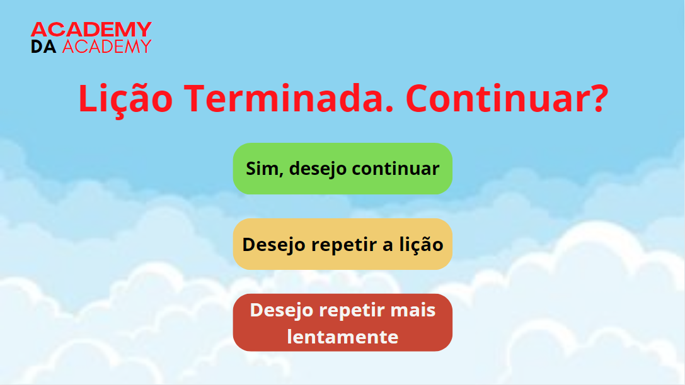<br>
<sub>Fonte: Material produzido pelos autores (2024)</sub>
</div><br>

&nbsp;&nbsp;&nbsp;&nbsp;Os professores também receberão um certificado ao final do jogo que reflete sua habilidade em se locomover na plataforma. As fases serão representadas visualmente através de uma jornada ascendente nas nuvens, a progressão seria da seguinte forma:

<div align="center">
<sub>Figura 33 - Menu de fases</sub>
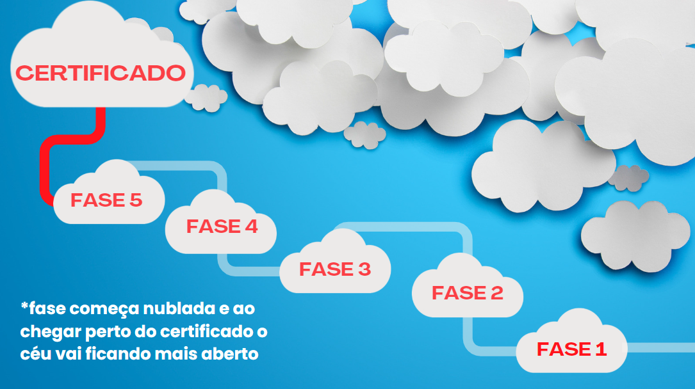<br>
<sub>Fonte: Material produzido pelos autores (2024)</sub>
</div><br>

&nbsp;&nbsp;&nbsp;&nbsp;A parte prática que fizemos foi criar uma tela inicial, um fundo com uma textura que se mexe, e um botão que ao clicado, abrem-se as nuvens para revelar o nome do jogo. Posteriormente, seria interessante adicionar algumas opções abaixo da logo, como por exemplo o botão de iniciar o jogo. Aqui está a tela inicial com o botão e o que acontece quando pressionado:

<div align="center">
<sub>Figura 34 - Botão de início</sub>
<br>
<sub>Fonte: Material produzido pelos autores (2024)</sub>
</div><br>

<div align="center">
<sub>Figura 35 - Nuvens abrindo</sub>
<br>
<sub>Fonte: Material produzido pelos autores (2024)</sub>
</div><br>

<div align="center">
<sub>Figura 36 - Nuvens completamente abertas</sub>
<br>
<sub>Fonte: Material produzido pelos autores (2024)</sub>
</div><br>

&nbsp;&nbsp;&nbsp;&nbsp;Entendemos que houveram certas dificuldades no meio da produção desse sprint. A falta de conhecimento técnico do framework e da linguagem de programação, um feriado que tirou 3 dias de aula, mudanças de organização do grupo e de descobertas de requesitos, tudo isso influenciou na entrega de um produto que por mais que seja funcional, ainda tem muito potencial que por conta desses impecílios, não demos conta de implementar. Mas será a prioridade do grupo que no próximo sprint busquemos todas essas oportunidades e ideias adicionando ainda mais outras.

## 4.2. Desenvolvimento básico do jogo

&nbsp;&nbsp;&nbsp;&nbsp;Com base nos feedbacks na apresentação dos conceitos da primeira sprint, decidimos então desenvolver a primeira fase do jogo, que consiste em organizar polaroids em uma mesa na ordem certa de modo a fazer alusão ao processo de realizar login na Oracle Academy. As fotos são arrastáveis com o mouse, permitindo o movimento pelo jogador ao longo da tela. Ao completar um set de 3 polaroids em ordem correta, estas são retiradas e novos espaços são abertos para inserir a próxima sequência. A principal missão dessa fase é o aprendizado e reforço das informações que são descobertas, associando posteriormente, a experiência de realizar o login na própria plataforma.

<div align="center">
<sub>Figura 37 - Print tirado da primeira fase do jogo</sub><br>
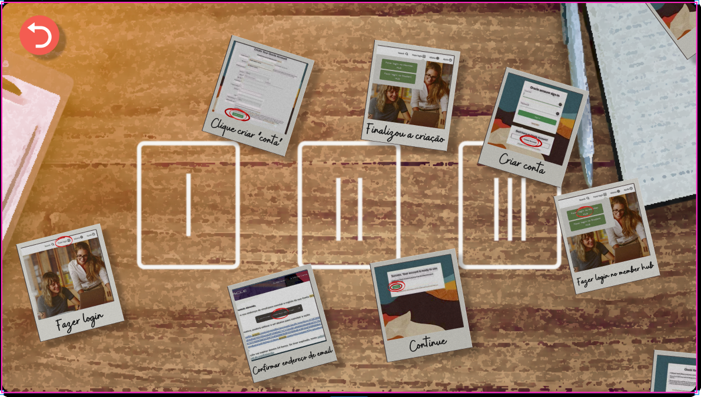<br>
<sub>Fonte: Material produzido pelos autores (2024)</sub>
</div><br>

&nbsp;&nbsp;&nbsp;&nbsp;Também criamos a aba de créditos dentro da tela inicial do jogo, que inclui os autores do jogo, ao passar o mouse em cima dos alunos da esquerda; os orientadores e professores do projeto, nos alunos da direita; e os objetivos e público alvo do jogo ao colocar o mouse sobre a professora.

<div align="center">
<sub>Figura 38 -Tela de Créditos</sub><br>
<br>
<sub>Fonte: Material produzido pelos autores (2024)</sub>
</div><br>

&nbsp;&nbsp;&nbsp;&nbsp;Uma das principais mudanças da primeira sprint para esta foi a mudança estética do jogo, alterando a ideia de um céu nublado por um mapa mundi. Seguindo esta mudança, a cor de fundo da tela inicial foi alterada para condizer com a mudança visual.

<div align="center">
<sub>Figura 39 - Menu de fases</sub><br>
<br>
<sub>Fonte: Material produzido pelos autores (2024)</sub>
</div>
<br>
<div align="center">
<sub>Figura 40 - Nova tela inicial</sub><br>
<br>
<sub>Fonte: Material produzido pelos autores (2024)</sub>
</div>
<br>

&nbsp;&nbsp;&nbsp;&nbsp;Por fim, realizamos uma coleta de ideias por meio do Crazy 8s para auxiliar na definição das fases que terão que ser implementadas nos próximos sprints.

<div align="center">
<sub>Figura 41 - Concept Art dos Minijogos</sub><br>
<br>
<sub>Fonte: Material produzido pelos autores (2024)</sub>
</div>
<br>

&nbsp;&nbsp;&nbsp;&nbsp;A fase 2 será representativa de uma escavação arqueológica, em que o jogador irá desenterrar os recursos ao qual ele tem acesso na plataforma da Oracle Academy. A fase 3 será sobre conectar fios em um servidor. A fase 4 será sobre explorar os caminhos certos no arquipélago da Indonésia, para seguir as instruções de criação de conta Cloud. A última fase simulará o suporte ao professor que o jogador tem acesso, exemplificando casos em que possa precisar de ajuda.

## 4.3. Desenvolvimento intermediário do jogo

&nbsp;&nbsp;&nbsp;&nbsp;Nessa sprint, adicionamos algumas melhorias à fase já existente da mesa com polaroids, possibilitando que, conforme feedback do parceiro, as polaroids pudessem ser ampliadas para que fossem melhores vistas. Também foi ampliado o número de cenas para contemplar um maior número de polaroids, já que estavam faltando alguns passos no tutorial.

&nbsp;&nbsp;&nbsp;&nbsp;Para a visualização das polaroids em tamanho ampliado, começamos chamando a função por nós definida como addBiggerPolaroids, passando como parâmetor a classe atual da cena, conforme o padrão das outras já feitas anteriormente.

```javascript
create() {
    this.camera.main.fadeIn(400, 0, 0, 0);
    //criação das DropZones
    addDropzone(this);
    //adicionando camadas da mesa
    addTable(this);
    //Adicionando polaroids maiores
    addBiggerPolaroid(this);
    //Adicionando Polaroids
    addPolaroid(this);
    //Adiciona aba escura com instruções
    addInstructions(this);
    //Adicionando Inputs
    addInput(this);
}
```

&nbsp;&nbsp;&nbsp;&nbsp;A função chamada está definida conforme abaixo, na mesma lógica de adição das polaroids normais, porém colocando numa camada ainda maior e movendo-as de acordo com os cliques do usuário, seja para mostrá-la ou tirá-la da tela.

```javascript
function addBiggerPolaroid(scene) {
  for (let i = 0; i < polaroids.lenght; i++) {
    biggerPolaroids[i] = scene.add
      .sprite(2000, 2000, `gpolaroid${i + 1}`)
      .setScale(0.4)
      .setInteractive({ cursor: "pointer" })
      .setDepth(10)
      .setVisible(true)
      .on("pointerdown", function () {
        biggerPolaroids[i].x = 2000;
        biggerPolaroids[i].y = 2000;
      });
  }
}
```

&nbsp;&nbsp;&nbsp;&nbsp;Para completar a sequência de polaroids no número correto, foi chamada uma nova cena caso as oito polaroids iniciais fossem preenchidas. A nova cena é exatamente igual à imediatamente anterior, porém com outros assets sendo carregados para as novas polaroids.

```javascript
if (polaroidsFixed == 8) {
  nextButton(scene);
}
```

&nbsp;&nbsp;&nbsp;&nbsp;Desenvolvemos o Menu de Fases, tornando-o funcional para acessar tanto a fase 1 quanto a fase 2, podendo transitar entre elas quando quiser.
<br>

<div align="center">
<sup>Figura 42 - Imagem do mapa</sup>
<br>
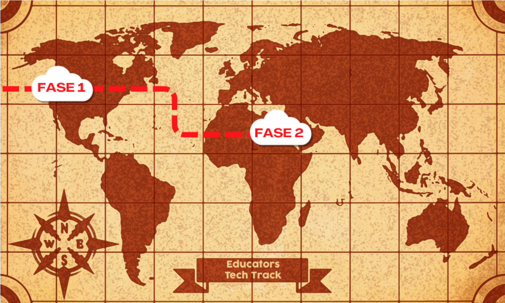
<sup>Fonte: Material produzido pelos autores (2024)</sup>
</div>
<br>
&nbsp;&nbsp;&nbsp;&nbsp;Desenvolvemos a fase 2 por completo, consistindo num puzzle de escavação e interpretação de informação, o jogador deve procurar os itens pela areia e analisar qual descoberta é útil ou não, tendo a opção de armazenar ou descartar.
<br>
<div align="center">
<sup> Figura 43 - Imagem da fase 2 </sup>
<br>
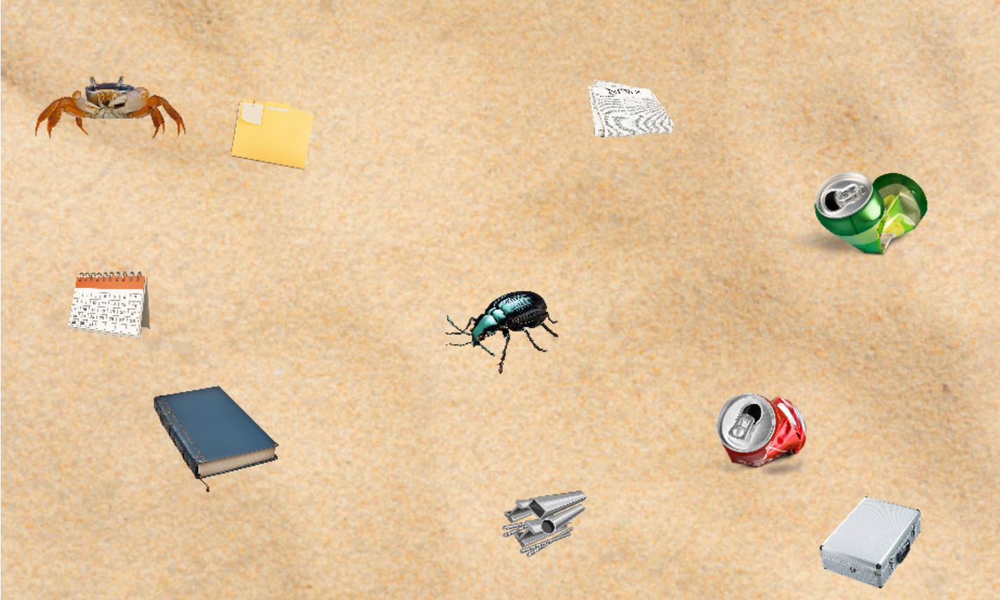
<sup>Fonte: Jogo autoral</sup>
<br>
<sup>Figura 44 - Imagem do pergaminho</sup>

<sup>Fonte: Jogo autoral</sup>
</div>

&nbsp;&nbsp;&nbsp;&nbsp;A Fase 3 esta em fase de concept, junto com as Fases 4 e 5 que serão implementadas ao longo do próximo sprint, junto a alterações que serão pedidas no dia da apresentação (15/03).

## 4.4. Desenvolvimento final do MVP

&nbsp;&nbsp;&nbsp;&nbsp;Visando o desenvolvimento final do MVP, utilizamos da quarta sprint para terminar o desenvolvimento da fase 3, idealizar a quarta fase e desenvolve-lá.

&nbsp;&nbsp;&nbsp;&nbsp;Escolhemos um servidor polonês para situar a terceira fase, a Polônia foi escolhida por ser um dos países com mais servidores do mundo. A mecânica da fase é centrada no "conserto" do servidor. Ao longo da fase, o jogador tem que conectar cabos e organizar peças para completar a fase.

<div align="center">
<sup>Figura 45 - Imagem da fase 3</sup>
<br>
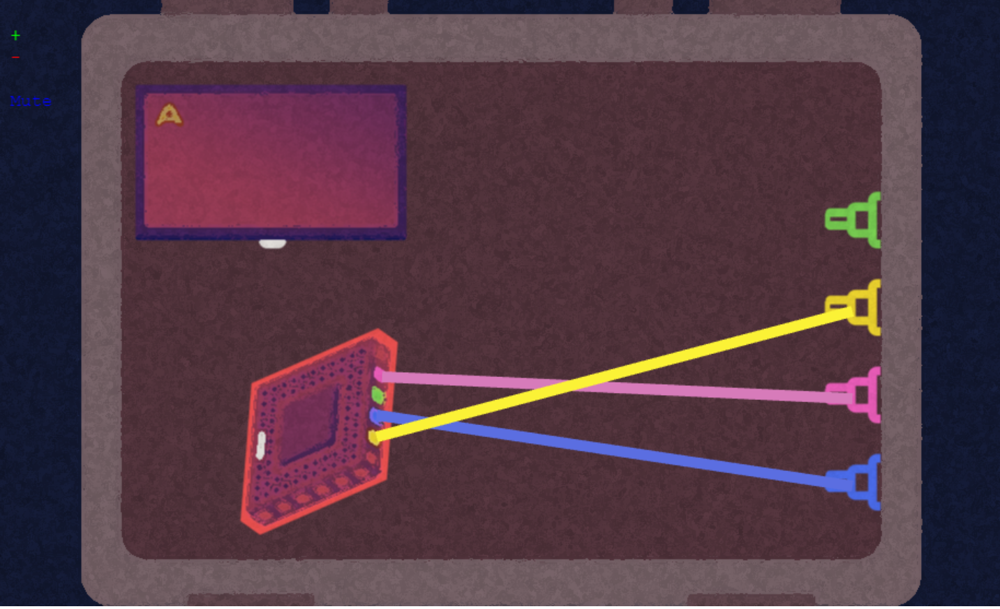
<sup>Fonte: Material produzido pelos autores (2024)</sup>
</div>

&nbsp;&nbsp;&nbsp;&nbsp;Após a entrega da fase 3, partimos em direção ao desenvolvimento da fase 4. A Ilha de Java foi a escolhida para situar essa fase, achamos que seria legal escolher lugares diversos, uma vez que traz diversidade para o nosso jogo. Nessa fase precisamos abrir baús em todo o território da ilha para descobrir informações sobre a introdução de alunos na Cloud. Depois de descobrir as informações, o jogador precisará "empurrar" os alunos para a "nuvem", entretanto, os alunos são "teimosos" e fogem do professor.

<div align="center">
<sup>Figura 46 - Imagem da primeira parte da fase 4</sup>
<br>
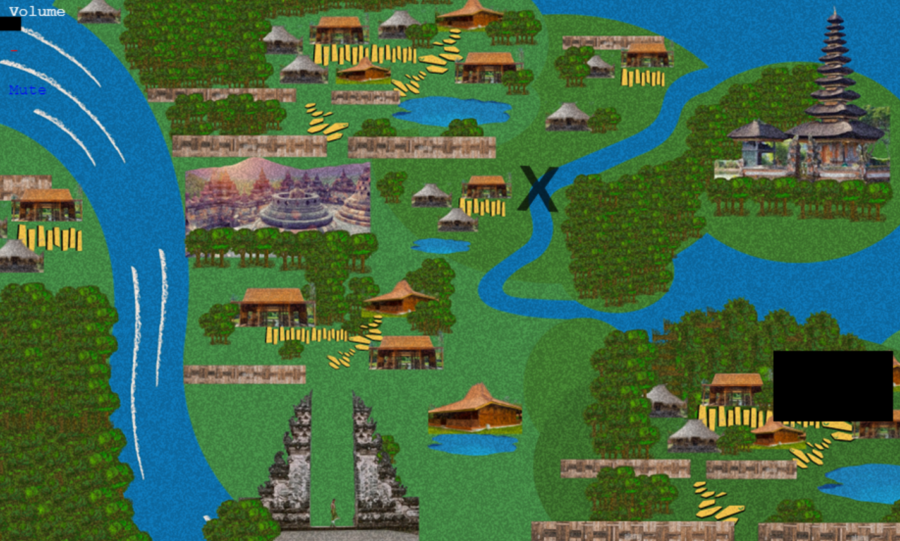
<sup>Fonte: Material produzido pelos autores (2024)</sup>
</div>
<div align="center">
<sup>Figura 47 - Imagem da segunda parte da fase 4</sup>
<br>
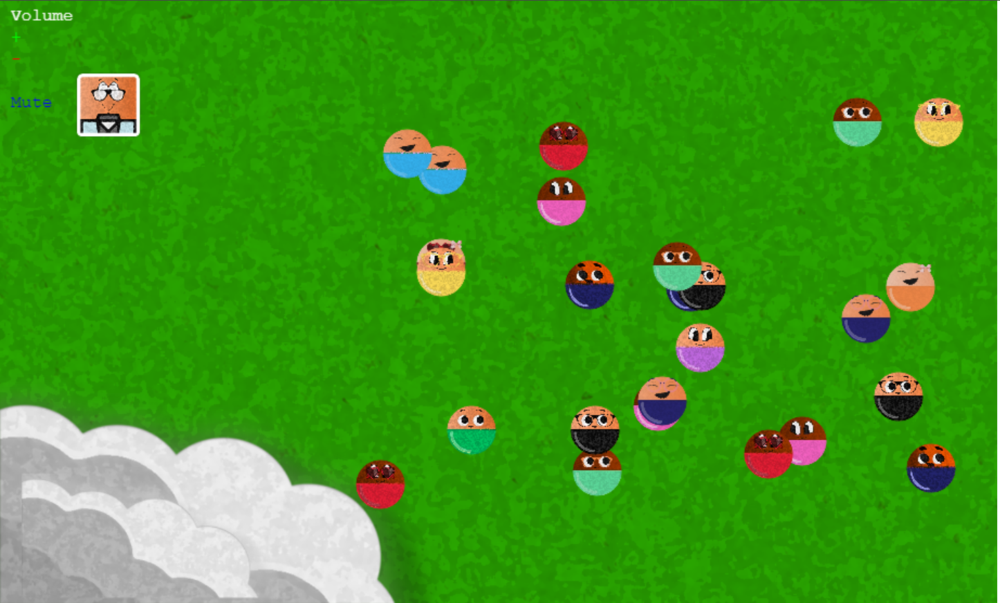
<sup>Fonte: Material produzido pelos autores (2024)</sup>
</div>

&nbsp;&nbsp;&nbsp;&nbsp;Ao longo da quarta sprint, tivemos um pouco de dificuldade na implementação das nossas ideias, uma vez que foram muitas, mas tivemos que filtrar as melhores para implementá-las. Inicialmente, tinhamos a ideia de implementar uma quinta fase ainda nessa sprint, mas devido ao número e complexidade das atividades, essa implementação tornou-se inviável.Visando o desenvolvimento futuro do projeto, queremos utilizar da quinta sprint para refinar o projeto e resolver alguns bugs descobertos nos playtests. Queremos também aumentar a intuitivade do jogo, mudando alguns botões e deixando alguns dados mais destacados.

## 4.5. Revisão do MVP

&nbsp;&nbsp;&nbsp;&nbsp; Visando o refinamento de nosso projeto, direcionamos nossos trabalhos principalmente para a área do GDD, corrigindo Issues abertas,completando partes que estavam faltando.
<br>

<div align="center">
<sup>Figura 48 - Imagens de tarefas do GDD</sup>
<br>
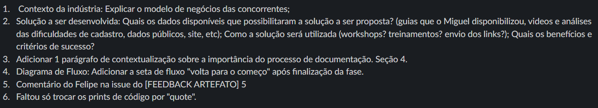
<sup> Fonte: Grupo no Slack do grupo </sup>
</div>

&nbsp;&nbsp;&nbsp;&nbsp; Junto a isso, focamos também na implementação do sistemas de sons do jogo e na melhora visual de nosso mixer, colocando assets que facilitam a compreensão e visualização, e para finalizar configuramos diversos efeitos sonoros ao longo do jogo como "correto" "errado" "fase completa".
<br>

<div align="center">
<sup>Figura 49 - Imagem da tela inicial com a engrenagem de sons no canto superiror esquerdo<sup>
<br>
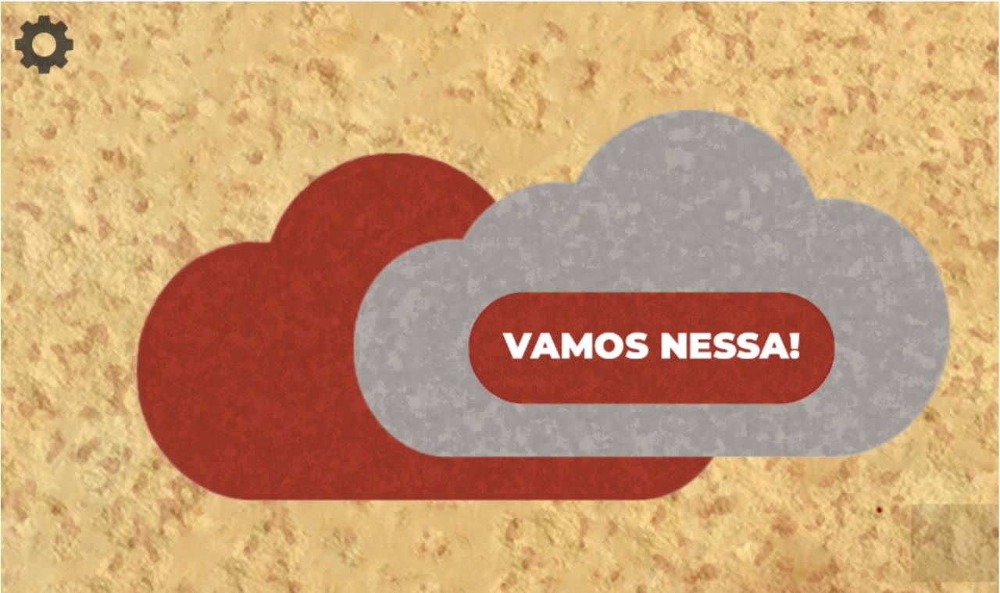
<sup>Fonte: Material produzido pelos autores (2024)</sup>
</div>
<br>
<div align="center">
<sup>Figura 50 - Imagem da tela inicial mostrando as configurações de volume<sup>
<br>
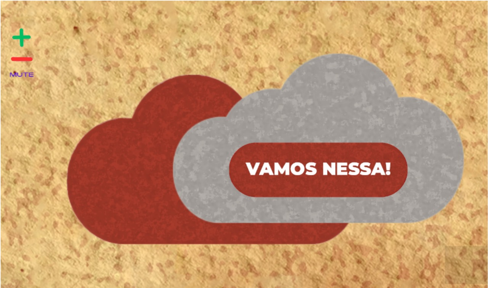
<sup>Fonte: Material produzido pelos autores (2024)</sup>
</div>
<br>

&nbsp;&nbsp;&nbsp;&nbsp; Esse último Sprint, o grupo estava mais tranquilo em relação as tarefas por termos conseguido implementar boa parte que queríamos no Sprint passado, focamos mais no próprio refinamento e pequenas alterações.

# <a name="c5"></a>5. Testes

## 5.1. Casos de Teste

&nbsp;&nbsp;&nbsp;&nbsp; Os casos de testes aqui descritos contemplam tudo o que pode e deve funcionar dentro de nosso jogo, desde o clique de botões, funcionalidades dos puzzles até transição de cenas.

<div align="center">
<sub>Tabela 5 - Representação dos casos de testes</sub><br>

| \#  | pré-condição                                             | descrição do teste                                                                                                  | pós-condição                                                                    |
| --- | -------------------------------------------------------- | ------------------------------------------------------------------------------------------------------------------- | ------------------------------------------------------------------------------- |
| 1   | posicionar o jogo na tela de abertura                    | iniciar o jogo na tela de início                                                                                    | o usuário deve ver a tela de início                                             |
| 2   | clicar no botão                                          | as nuvens devem se arrastar lateralmente                                                                            | o logo do jogo precisa aparecer                                                 |
| 3   | início da tela de créditos                               | todos os assets devem carregar em suas respectivas posições                                                         | a tela deve estar completa com a imagem da sala de aula                         |
| 4   | passar mouse em cima de uma imagem com bordas iluminadas | o crédito relacionado a essa respectiva imagem deve aparecer com um background escuro com baixa opacidade           | o crédito deve sumir ao tirar o mouse da imagem e voltar para como estava antes |
| 5   | clicar em "começar jogo" na tela de créditos             | transição para a cena do menu de fases                                                                              | tela do menu de fases                                                           |
| 6   | Clicar nas nuvens do Menu de Fases                       | transição do Menu para cada Fase, independente de qual seja                                                         | O usuário deve acessar a fase selecionanda                                      |
| 7   | clicar nas polaroids (Fase 1)                            | Receber informações mais detalhadas da polaroid                                                                     | O usuário deve ver a informação ampliada e detalhada                            |
| 8   | Arrastar as polaroids (Fase 1)                           | Arrastar cada polaroid                                                                                              | locomover as polaroids pela tela                                                |
| 9   | Colocar a polaroid nos espaços corretos                  | Fixar a polaroid na ordem correta de acordo com que está escrito                                                    | Fixar a polaroid                                                                |
| 10  | Clicar no botão de avançar (Fase 1)                      | depois da primeira sessão de polaroids vem a seguinte, e para transitar de uma para outra, tem que apertar no botão | Transitar da primeira cena de polaroid para segunda                             |
| 11  | Arrastar as polaroids (fase 1)                           | Arrastar cada polaroid                                                                                              | Locomover as polaroids pela tela                                                |
| 12  | Colocar a polaroid nos espaços corretos (fase 1)         | Fixar a polaroid na ordem correta de acordo com que está escrito                                                    | Fixar a polaroid                                                                |
| 13  | Clicar no botão "próximo" (fase 1)                       | Ao pressionar botão de próximo, deveria voltar ao menu de fases                                                     | Menu de fases                                                                   |
| 14  | Instruções da (fase 2)                                   | Depois que clicar em qualquer lugar na tela de instruções, deve ir para a tela da fase, com areia                   | areia                                                                           |
| 15  | areia (fase 2)                                           | ao arrastar o mouse na areia, sobre um item, ele deve se tornar cada vez mais visível                               | item aparece                                                                    |
| 16  | item na areia (fase 2)                                   | ao clicar no item na areia, aparece uma descrição do mesmo, um botão de tick e um botão de lixo                     | descrição aparece                                                               |
| 17  | botões tick/lixo (fase 2)                                | ao clicar o botão de tick/lixeira certo relacionado a dado item, a descrição some e volta a areia                   | areia com items                                                                 |
| 18  | sem nenhum item na tela (fase 2)                         | com todos items descobertos e suas descrições lidas, deveria aparecer o botão de próximo                            | botão de "próximo"                                                              |
| 19  | clicar no botão de próximo (fase 2)                      | ao clicar no botão de próximo deve aparecer a tela de menu de fases                                                 | menu de fases                                                                   |
| 20  | clicar no computador (fase 3)                            | abrir a tela de sistema operacional com instruções                                                                  | tela de sistema operacional                                                     |
| 21  | clicar no botão "concerte os servidores" (fase 3)        | mudança de tela para uma mala, "A" e "B" em que o usuário deve seguir as instuções                                  | Aparece mala, "A" e "B"                                                         |
| 22  | passar mouse em cima da mala (fase 3)                    | mala deve abrir e item vermelho ou azul deve aparecer                                                               | item vermelho ou azul                                                           |
| 23  | arrastar item até A ou B (fase 3)                        | item, quando arrastado para o lado certo, A ou B, deve fazer aparecer um servidor embaixo da letra                  | aparecer servidor                                                               |
| 24  | clicar no botão de próximo (fase 3)                      | após clicar no botão de próximo deve aparecer o computador novamente                                                | aparecer tela do computador                                                     |
| 25  | clicar no computador (fase 3)                            | abrir a tela de sistema operacional com instruções                                                                  | tela de sistema operacional                                                     |
| 26  | clicar no botão "concerte os servidores" (fase 3)        | deve sumir o sistema operacional e aparecer um botão no lado esquerdo da tela                                       | tela de servidor e botão                                                        |
| 27  | clique no cabo na direita (fase 3)                       | cabo fica selecionado                                                                                               | cabo fica selecionado                                                           |
| 28  | clicar no conector da esquerda (fase 3)                  | cabo selecionado liga ao conector selecionado                                                                       | cabo e conector ligados                                                         |
| 29  | conectar cabos e conectores (fase 3)                     | conectar todos os cabos com seus respectivos conectores                                                             | aparece uma instrução                                                           |
| 30  | clicar na imagem de instrução (fase 3)                   | selecionar a imagem com instrução para ampliá-la                                                                    | imagem ampliada                                                                 |
| 31  | clicar na imagem ampliada (fase 3)                       | imagem some e volta para tela com o computador na sala de servidor                                                  | sala de servidor com computador                                                 |
| 32  | clicar no computador (fase 3)                            | abrir a tela de sistema operacional com instruções                                                                  | tela de sistema operacional                                                     |
| 33  | clicar no botão "concerte os servidores" (fase 3)        | deve sumir o sistema operacional e aparecer um botão no lado esquerdo da tela                                       | tela de servidor e botão                                                        |
| 34  | clique no cabo na direita (fase 3)                       | cabo fica selecionado                                                                                               | cabo fica selecionado                                                           |
| 35  | clicar no conector da esquerda (fase 3)                  | cabo selecionado liga ao conector selecionado                                                                       | cabo e conector ligados                                                         |
| 36  | conectar cabos e conectores (fase 3)                     | conectar todos os cabos com seus respectivos conectores                                                             | aparece uma instrução                                                           |
| 37  | clicar na imagem de instrução (fase 3)                   | selecionar a imagem com instrução para ampliá-la                                                                    | imagem ampliada                                                                 |
| 38  | clicar na imagem ampliada (fase 3)                       | imagem some e volta para tela com o computador na sala de servidor                                                  | sala de servidor com computador                                                 |
| 39  | clicar no computador (fase 3)                            | abrir a tela de sistema operacional com instruções                                                                  | tela de sistema operacional                                                     |
| 40  | clicar no botão "continuar a aventura" (fase 3)          | o jogo deve mudar para a fase 3, dos servidores, e voltar para o menu de fases                                      | menu de fases                                                                   |
| 41  | Clicar em um "X" no mapa (fase 4)                        | Ao selecionar algum "X" vermelho no mapa, e esperar a camera dar zoom in, aparece um baú                            | Zoom in e baú                                                                   |
| 42  | Clicar no baú (fase 4)                                   | Depois que clicar no baú, deve aparecer um pop up com instruções relacionadas a Oracle Academy                      | Pop up instrução/passo                                                          |
| 43  | Fechar pop up instrução/passo (fase 4)                   | Clicar no "x" no canto direito em cima do pop up, o pop up e o baú deve sumir, e dar zoom out                       | Sumir baú e instrução                                                           |
| 44  | Todos os baús (fase 4)                                   | Clicar e ler os pop ups de todos os baús, o jogo deve mudar de cena para um professor e alunos                      | Professor, nuvem, alunos                                                        |
| 45  | Professor Cursores (fase 4)                              | Utilizando os cursores do teclado, deveria ser possível controlar a direção que o professor se move                 | Movimento Professor                                                             |
| 46  | Professor Parado (fase 4)                                | Apertar o cursor para cima o professor deve se mover para cima                                                      | Movimento Cima Professor                                                        |
| 47  | Professor Parado (fase 4)                                | Apertar o cursor para cima o professor deve se mover para baixo                                                     | Movimento Baixo Professor                                                       |
| 48  | Professor Parado (fase 4)                                | Apertar o cursor para cima o professor deve se mover para direita                                                   | Movimento Direita Professor                                                     |
| 49  | Professor Parado (fase 4)                                | Apertar o cursor para cima o professor deve se mover para esquerda                                                  | Movimento Esquerda Professor                                                    |
| 50  | Professor Colide Aluno (fase 4)                          | Ao professor colidir com o aluno, o mesmo deve se movimentar na direção oposta ao professor                         | Aluno Se Move                                                                   |
| 51  | Aluno Colide Nuvem (fase 4)                              | O aluno, em movimento, quando se colidir com a nuvem deve desaparecer                                               | Aluno Some                                                                      |
| 52  | Alunos Somem (fase 4)                                    | Quando certas quantidades de alunos sumirem, pop ups relacionados a Oracle Academy devem aparecer                   | Pop up instrução/passo                                                          |
| 53  | Pop up instrução/passo (fase 4)                          | Clicar no "x" no canto direito em cima do pop up, o pop up deve sumir e retornar ao jogo                            | Jogo                                                                            |
| 54  | Todos Alunos (fase 4)                                    | Um vez que todos os alunos sumiram na núvem, o último pop-up aparece, chamado "Parabéns"                            | Último Pop Up                                                                   |

<sub>Fonte: Material produzido pelos autores (2024)</sub>

</div>
<br>

## 5.2. Testes de jogabilidade (playtests) (sprint 4)

### 5.2.1 Registros de testes

<div align="center">
<sub>Tabela 5 - Representação do playtest 1</sub><br>

| Testador            | Iris                      |
| ------------------- | ------------------------- |
| Teste conduzido por | Marcelo, Lucas, Davi      |
| Local               | Durante a instrução de UX |
| Dia                 | 08/03/2024                |
| Duração             | 10 minutos                |
| Dispositivo         | Computador de Davi        |

| Nome                                     | Iris                                                            |
| ---------------------------------------- | --------------------------------------------------------------- |
| Já possuía experiência prévia com games? | sim                                                             |
| Conseguiu iniciar o jogo?                | sim                                                             |
| Entendeu as regras e mecânicas do jogo?  | sim, com custo                                                  |
| Conseguiu progredir no jogo?             | sim                                                             |
| Apresentou dificuldades?                 | sim, demorou para entender que precisava organizar os polaroids |
| Que nota deu ao jogo?                    | 8.0                                                             |
| O que gostou no jogo?                    | Design e estética                                               |
| O que poderia melhorar no jogo?          | Adicionar uma seta para voltar a fase                           |

| Avaliar/Observar durante o teste (Iris)                                    |                                                                                                                                                                    |
| -------------------------------------------------------------------------- | ------------------------------------------------------------------------------------------------------------------------------------------------------------------ |
| Como foi a experiência do jogador com o Game Design e Concept propostos?   | A experiencia da usuária foi positiva, ressaltou as cores e as texturas como ponto positivo, e gostou muito da temática que trouxemos                              |
| Como foi a experiência do jogador com os Level Design explorados no teste? | A usuária se sentiu confusa com o deveria ser feito e em qual ordem, principalmente na instrução, primeiramente arrumando as cartas e somente depois inspecionando |
| Como foi a experiência do jogador com a interface do jogo (GUI)?           | Um pouco confusa inicialmente por estar mais acostumada com o uso das setas do teclado para movimentação, sendo pouco claro quais controles necessários para usar  |
| Como foi a experiência do jogador com a HUD do jogo?                       | Em geral muito boa, citando sua fácil compreensão                                                                                                                  |

</div>
<div align="center">
<sub>Fonte: Material produzido pelos autores (2024)</sub>
</div>
<br>
<div align="center">
<sub>Tabela 6 - Representação do playtest 2</sub><br>

| Testador (id)       | Francisco                 |
| ------------------- | ------------------------- |
| Teste conduzido por | Marcelo, Lucas, Davi      |
| Local               | Durante a instrução de UX |
| Dia                 | 05/03/2024                |
| Duração             | 6 minutos                 |
| Dispositivo         | Computador de Lucas       |

| Nome                                     | Francisco                                                                                                               |
| ---------------------------------------- | ----------------------------------------------------------------------------------------------------------------------- |
| Já possuía experiência prévia com games? | Sim                                                                                                                     |
| Conseguiu iniciar o jogo?                | Sim                                                                                                                     |
| Entendeu as regras e mecânicas do jogo?  | Deu para entender                                                                                                       |
| Conseguiu progredir no jogo?             | Sim                                                                                                                     |
| Apresentou dificuldades?                 | Sim, ler e seguir e analisar as informações                                                                             |
| Que nota deu ao jogo?                    | 8,5                                                                                                                     |
| O que gostou no jogo?                    | Dos desenhos/estética                                                                                                   |
| O que poderia melhorar no jogo?          | Escrita das polaroids, aumentar o contorno da fase de créditos dos elementos, indicador que as polaroids estão corretas |

| Avaliar/Observar durante o teste (Francisco)                               |                                                                                                                                  |
| -------------------------------------------------------------------------- | -------------------------------------------------------------------------------------------------------------------------------- |
| Como foi a experiência do jogador com o Game Design e Concept propostos?   | Usuário pareceu consciente das mecânicas e funcionalidades da versão de teste, entendeu relativamente rápido como jogar a fase 1 |
| Como foi a experiência do jogador com os Level Design explorados no teste? | Usuário experimentou com todos os elementos do jogo                                                                              |
| Como foi a experiência do jogador com a interface do jogo (GUI)?           | Usuário parecia saber como utilizar a GUI, mas reclamou da leitura das polaroids                                                 |
| Como foi a experiência do jogador com a HUD do jogo?                       | Hud parecia intuitivo                                                                                                            |

</div>
<div align="center">
<sub>Fonte: Material produzido pelos autores (2024)</sub>
</div>
<br>
<div align="center">
<sub>Tabela 7 - Representação do playtest 3</sub><br>

| Testador (id)       | Yara                      |
| ------------------- | ------------------------- |
| Teste conduzido por | Lucas                     |
| Local               | Durante a instrução de UX |
| Dia                 | 05/03/2024                |
| Duração             | 7 minutos                 |
| Dispositivo         | Computador de Lucas       |

| Nome                                     | Yara                        |
| ---------------------------------------- | --------------------------- |
| Já possuía experiência prévia com games? | Sim                         |
| Conseguiu iniciar o jogo?                | sim                         |
| Entendeu as regras e mecânicas do jogo?  | sim                         |
| Conseguiu progredir no jogo?             | sim                         |
| Apresentou dificuldades?                 | Na hora de ler as polaroids |
| Que nota deu ao jogo?                    | 9                           |
| O que gostou no jogo?                    | Simples, dinâmico e prático |
| O que poderia melhorar no jogo?          | Escrita                     |

| Avaliar/Observar durante o teste (Yara)                                    |                                                                                                  |
| -------------------------------------------------------------------------- | ------------------------------------------------------------------------------------------------ |
| Como foi a experiência do jogador com o Game Design e Concept propostos?   | Usuário conseguiu entender o design geral, problemas na tela de créditos porém                   |
| Como foi a experiência do jogador com os Level Design explorados no teste? | Level design pouco confuso para o usuário na tela de créditos, intuitivo no resto                |
| Como foi a experiência do jogador com a interface do jogo (GUI)?           | Dificuldade de utilizar função de hover nos créditos para mostrar informações e botão de iniciar |
| Como foi a experiência do jogador com a HUD do jogo?                       | Experiência positiva, uso rápido                                                                 |

</div>
<div align="center">
<sub>Fonte: Material produzido pelos autores (2024)</sub>
</div>
<br>
<div align="center">
<sub>Tabela 8 - Representação do playtest 4</sub><br>

| Testador (id)       | Tadeu                     |
| ------------------- | ------------------------- |
| Teste conduzido por | Marcelo                   |
| Local               | Durante a instrução de UX |
| Dia                 | 05/03/2024                |
| Duração             | 6 minutos                 |
| Dispositivo         | Computador do Davi        |

| Nome                                     | Tadeu                                                                               |
| ---------------------------------------- | ----------------------------------------------------------------------------------- |
| Já possuía experiência prévia com games? | sim                                                                                 |
| Conseguiu iniciar o jogo?                | sim                                                                                 |
| Entendeu as regras e mecânicas do jogo?  | sim                                                                                 |
| Conseguiu progredir no jogo?             | sim                                                                                 |
| Apresentou dificuldades?                 | Sim, localizar o "iniciar jogo", leitura dos polaroids                              |
| Que nota deu ao jogo?                    | 8,5                                                                                 |
| O que gostou no jogo?                    | Ideia do usuário arrastar por si só as polaroids, cena dos créditos e bem avançados |
| O que poderia melhorar no jogo?          | Voltar a fase para rever o conteúdo                                                 |

</div>
<div align="center">
<sub>Fonte: Material produzido pelos autores (2024)</sub>
</div>
<br>
<div align="center">
<sub>Tabela 9 - Representação do playtest 5</sub><br>

| Testador (id)       | Paulo                     |
| ------------------- | ------------------------- |
| Teste conduzido por | Marcelo                   |
| Local               | Durante a instrução de UX |
| Dia                 | 08/03/2024                |
| Duração             | 7 minutos                 |
| Dispositivo         | Computador do Davi        |

| Nome                                     | Paulo                                                                                  |
| ---------------------------------------- | -------------------------------------------------------------------------------------- |
| Já possuía experiência prévia com games? | Já                                                                                     |
| Conseguiu iniciar o jogo?                | Sim                                                                                    |
| Entendeu as regras e mecânicas do jogo?  | Sim, com facilidade                                                                    |
| Conseguiu progredir no jogo?             | Sim                                                                                    |
| Apresentou dificuldades?                 | Sim, achou confuso e muitos elementos na tela, dificuldade em saber o que vem primeiro |
| Que nota deu ao jogo?                    | 8,8, não sabe se aprendeu certo                                                        |
| O que gostou no jogo?                    | Estética e jogabilidade                                                                |
| O que poderia melhorar no jogo?          | Começar com um puzzle mais fácil                                                       |

| Avaliar/Observar durante o teste (Paulo)                                   |                                                                 |
| -------------------------------------------------------------------------- | --------------------------------------------------------------- |
| Como foi a experiência do jogador com o Game Design e Concept propostos?   | Positiva, conseguiu avançar de forma progressiva durante o jogo |
| Como foi a experiência do jogador com os Level Design explorados no teste? | Pegou todas as ideias de forma fácil e intuitiva                |
| Como foi a experiência do jogador com a interface do jogo (GUI)?           | Positiva, entendeu tudo.                                        |
| Como foi a experiência do jogador com a HUD do jogo?                       | Positiva, entendeu as intruções que tinham nelas                |

</div>
<div align="center">
<sub>Fonte: Material produzido pelos autores (2024)</sub>
</div>
<br>
<div align="center">
<sub>Tabela 10 - Representação do playtest 6</sub><br></div>

| Testador            | Carlos                    |
| ------------------- | ------------------------- |
| Teste conduzido por | Matheus, Rodrigo          |
| Local               | Durante a instrução de UX |
| Dia                 | 27/03/2024                |
| Duração             | 20mins                    |
| Dispositivo         | Computador de Eduardo     |

| Nome                                     | Carlos                                                                   |
| ---------------------------------------- | ------------------------------------------------------------------------ |
| Já possuía experiência prévia com games? | Sim. Muita experiência.                                                  |
| Conseguiu iniciar o jogo?                | Sim                                                                      |
| Entendeu as regras e mecânicas do jogo?  | Sim                                                                      |
| Conseguiu progredir no jogo?             | Sim                                                                      |
| Apresentou dificuldades?                 | Um pouco                                                                 |
| Que nota deu ao jogo?                    | 7                                                                        |
| O que gostou no jogo?                    | Ficou fácil de entender a proposta                                       |
| O que poderia melhorar no jogo?          | Orientações do que o usuário tem que fazer em cada tela, e corrigir bugs |

| Avaliar/Observar durante o teste (Carlos)                                  |                                                                                                                                 |
| -------------------------------------------------------------------------- | ------------------------------------------------------------------------------------------------------------------------------- |
| Como foi a experiência do jogador com o Game Design e Concept propostos?   | Positiva. Porém, achou que coisas como "Polaroide" e instruções deveriam ser mais explicadas.                                   |
| Como foi a experiência do jogador com os Level Design explorados no teste? | O jogador mostrou diferentes decisões e combinações que ele considerava não necessariamentes intuitivos que podem levar a bugs. |
| Como foi a experiência do jogador com a interface do jogo (GUI)?           | Usuário entendeu o GUI.                                                                                                         |
| Como foi a experiência do jogador com a HUD do jogo?                       | Usuário entendeu o HUD.                                                                                                         |

<div align="center">
<sub>Fonte: Material produzido pelos autores (2024)</sub>
</div>
<br>
<div align="center">
<sub>Tabela 11 - Representação do playtest 7</sub><br>

| Testador            | Daniel                    |
| ------------------- | ------------------------- |
| Teste conduzido por | Matheus, Rodrigo          |
| Local               | Durante a instrução de UX |
| Dia                 | 27/03/2024                |
| Duração             | 10 minutos                |
| Dispositivo         | Computador de Eduardo     |

| Nome                                     | Daniel                                           |
| ---------------------------------------- | ------------------------------------------------ |
| Já possuía experiência prévia com games? | sim                                              |
| Conseguiu iniciar o jogo?                | sim                                              |
| Entendeu as regras e mecânicas do jogo?  | não entendeu a mecânica do deserto e do servidor |
| Conseguiu progredir no jogo?             | colocar as polaroids no lugar                    |
| Apresentou dificuldades?                 | sim                                              |
| Que nota deu ao jogo?                    | 8                                                |
| O que gostou no jogo?                    | visual, música                                   |
| O que poderia melhorar no jogo?          | as instruções de jogabilidade                    |

<sub>Fonte: Material produzido pelos autores (2024)</sub>

</div>
<br>

### 5.2.2 Melhorias

&nbsp;&nbsp;&nbsp;&nbsp;Durante os playtests realizados, provou-se que a mecânica da fase 3 não está intuitiva, o que fez com que alguns jogadores não conseguissem progredir na fase. Ademais, percebemos também com o teste do professor Cláudio que alguns detalhes precisam ser reparados, como um bug nas polaroids da fase 1 e um problema de dimensionamento da tela na fase 4.

# <a name="c6"></a>6. Conclusões e trabalhos futuros

&nbsp;&nbsp;&nbsp;&nbsp;Em conclusão, podemos afirmar que os objetivos deste trabalho, delineados no item 1.1.3 (Descrição da Solução Desenvolvida), foram alcançados: buscávamos solucionar o desafio de integração dos professores na plataforma Oracle Academy, tornando o processo de onboarding mais acessível por meio de um jogo disponibilizado online. Como resultado deste esforço, conseguimos desenvolver um jogo com quatro fases, acessível através do Git Pages.

&nbsp;&nbsp;&nbsp;&nbsp;Inicialmente, conforme estipulado no item 1.1.3, almejávamos empregar estratégias de gamificação para tornar o aprendizado das funcionalidades, navegação e criação de contas na plataforma mais interativo e envolvente. Nesse contexto, introduzimos o conceito de puzzles aleatórios, proporcionando uma dinâmica renovada em cada fase.

&nbsp;&nbsp;&nbsp;&nbsp;Desde o início, também tínhamos como objetivo utilizar os recursos fornecidos pelo parceiro, como o guia de cores da empresa, o próprio TAPI, o site da Oracle e da Oracle Academy, para criar uma identidade visual texturizada, utilizando cores que seguem as diretrizes do manual de marcas da Oracle Academy.

&nbsp;&nbsp;&nbsp;&nbsp;A Educators Tech Track representa uma solução envolvente para superar os obstáculos de usabilidade enfrentados pelos educadores na plataforma Oracle Academy. Não apenas abordamos a questão da distração digital, mas também transformamos a jornada de aprendizado em uma experiência memorável e eficaz. Com potencial para expansão em novas fases e contextos culturais, nosso jogo está preparado para impulsionar a inovação pedagógica e capacitar os usuários da plataforma com entusiasmo e competência.

&nbsp;&nbsp;&nbsp;&nbsp;Na Oracle Academy, podemos orgulhosamente afirmar que nosso jogo pode ser adaptado para diferentes necessidades em colaboração com a Oracle, pois compreendemos nosso público e reconhecemos um problema tão comum nos dias de hoje: a dificuldade de manter a atenção do usuário diante da tela. Assim, nossas fases podem ser expandidas e podemos inclusive desenvolver uma quinta fase, a fase final, ambientada no Brasil e simulando uma conversa pelo WhatsApp, já que o Brasil é o país que mais utiliza a plataforma no mundo. Isso completaria um ciclo de cinco quebra-cabeças, sem repetições em momento algum. Além disso, temos ideias para aumentar a acessibilidade dentro do jogo.

# <a name="c7"></a>7. Referências

GAMES, Supernova. Carcará: Asas da Justiça. Fortaleza: Supernova Games, 2014.<br>

RUNDISC. Chants of Sennaar. Paris: Focus Home Interactive, 2023.<br>

BEAM, Witch. Unpacking. Brisbane: Humble Games, 2021<br>

INFERNO, Max. A Little to the Left. Sheffield: Secret Mode, 2022. <br>

INFORSATO, E. C.; ROBSON, A. S. A preparação das aulas. In: UNIVERSIDADE ESTADUAL PAULISTA. Prograd. **Caderno de Formação:** formação de professores didática
geral. São Paulo: Cultura Acadêmica, 2011, p. 86-99, v. 9.<br>

CAMBRIDGE DICTIONARY. **puzzle**. Disponível em: <https://dictionary.cambridge.org/dictionary/english/puzzle>. Acesso em 27 fev. 2024<br>

gov, INEP. Disponível em: https://www.gov.br/inep/pt-br/assuntos/noticias/institucional/dados-revelam-perfil-dos-professores-brasileiros#:~:text=Neste%20s%C3%A1bado%2C%2015%20de%20outubro%2C%20celebra%2Dse%20o%20Dia,Censo%20da%20Educa%C3%A7%C3%A3o%20Superior%202020. Acesso em: 9 abril. 2024

TOKARNIA, MARIANA. agênciaBrasil. Disponível em: https://agenciabrasil.ebc.com.br/educacao/noticia/2019-07/maioria-dos-professores-aprende-sozinha-informacoes-sobre-tecnologia. Acesso em: 9 abril. 2024

DICHEV, C.; DICHEVA, D. Gamifying education: What is known, what is believed and what remains uncertain: A critical review. International Journal of Educational Technology in Higher Education, v. 14, n. 1, 20 fev. 2017.

KHALDI, A.; BOUZIDI, R.; NADER, F. Gamification of e-learning in higher education: a systematic literature review. Smart Learning Environments, v. 10, n. 1, 31 jan. 2023.

MONTENEGRO-RUEDA, M. et al. Impact of Gamified Teaching on University Student Learning. Education Sciences, v. 13, n. 5, p. 470, 1 maio 2023.

SMIDERLE, R. et al. The impact of gamification on students’ learning, engagement and behavior based on their personality traits. Smart Learning Environments, v. 7, n. 1, 9 jan. 2020.

ANHUT, A. Color Theory For Game Design 1 of 4 – Fundamentals. Disponível em: <http://howtonotsuckatgamedesign.com/2014/11/color-theory-game-design-1-fundamentals/>. Acesso em 2 abr. 2024

SCHUYTEMA, Paul. Design de Games: uma abordagem prática. Cengage Learning Brasil, 2008. E-book.

COPES, F. Phaser: Multiple scenes. Disponível em: <https://flaviocopes.com/phaser-multiple-scenes/>. Acesso em: 28 mar. 2024.

# <a name="c8"></a>Anexos

&nbsp;&nbsp;&nbsp;&nbsp;Não se aplica
